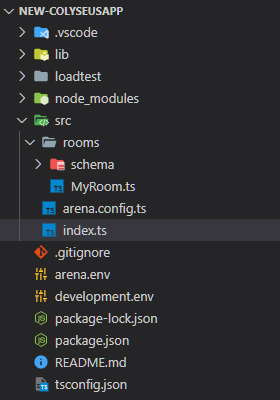

# 修改现有 Colyseus 服务器

如果您拥有自己写好的 Colyseus 服务器或者刚在自托管服务器上进行初始化安装, 那么服务器的文件夹结构应该是下面那个样子滴.

### 自托管的 index.ts


## Arena Cloud 上的必要修改

要使用 Arena Cloud, 必须修改上述服务器代码以使用当前的 **NPM** Colyseus 模板. 一般来说, 这些修改跟现有的 0.14 版本服务器差别不大. 只需要您将房间定义和自定义的 express 路由移入 ```arena.config``` 文件中. 比如上面的示例, 应该修改服务器代码如下.

!!! NOTE
    9/14/2021 更新: 您可能注意到, 我们不需要在 Arena Cloud 上定义驱动程序. 这是因为 Arena Cloud 在后台自动对 Colyseus 服务器所需的各种基础服务和数据库进行平衡和缩放. 因此作为开发人员, 您不需要定义 ***presence*** / ***matchmaking*** 这类驱动程序或部署和托管数据库.


### 修改后的 arena.config.ts

```
import Arena from "@colyseus/arena";
import { monitor } from "@colyseus/monitor";
import { uWebSocketsTransport } from "@colyseus/uwebsockets-transport";
//import { WebSocketTransport } from  "@colyseus/ws-transport";
import { ShootingGalleryRoom } from "./rooms/ShootingGalleryRoom";
const port = Number(process.env.PORT);

export default Arena({
    getId: () => "Your Colyseus App",

    initializeGameServer: (gameServer) => {

        gameServer.define('ShootingGalleryRoom', ShootingGalleryRoom);

    },

    initializeTransport: (options) => {

        return new uWebSocketsTransport({});

        /**
         * 定义服务器传输层协议为原始 WS (旧版)
         */
        // return new WebSocketTransport({
        //     ...options,
        //     pingInterval: 5000,
        //     pingMaxRetries: 3,
        // });
    },

    initializeExpress: (app) => {

        app.get("/", (req, res) => {
            res.send("It's time to kick ass and chew bubblegum!");
        });

        app.use("/colyseus", monitor());
    },


    beforeListen: () => {
        console.log(`Listening on ws://localhost:${ port }`)
    }
});
```

### 修改后的文件夹结构


