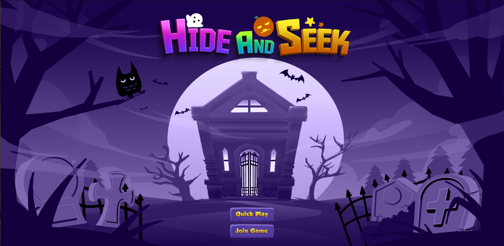
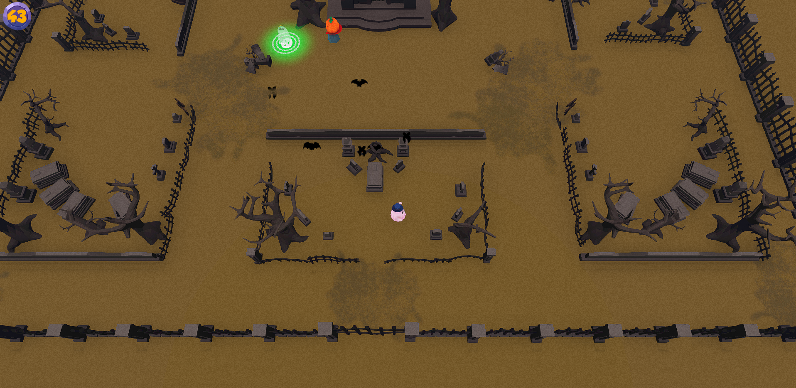
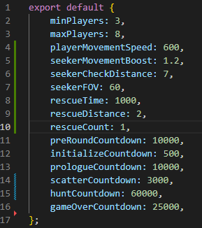
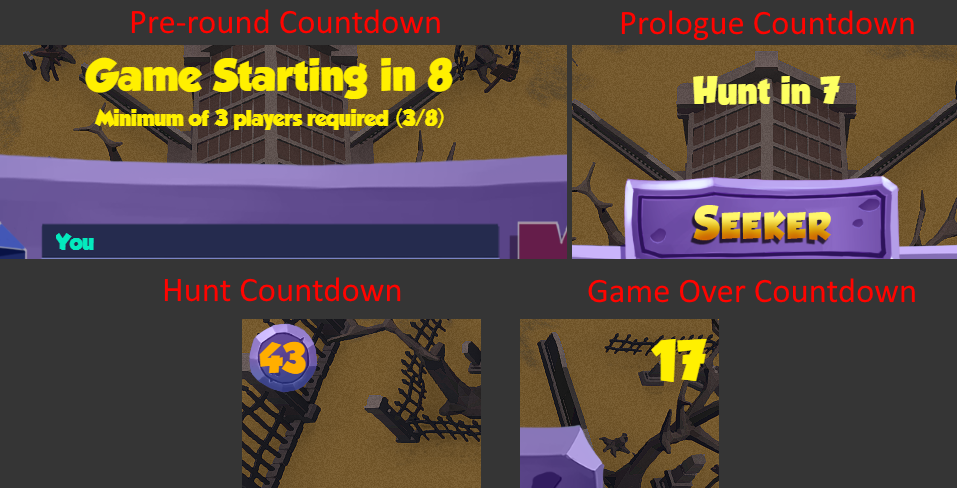

# Hide and Seek Tech Demo

## Technical Requirements
- Node.js v14.0 or higher
- Colyseus 0.14.20
- Colyseus Client SDK 0.14.13
- Babylon.js Editor 4.4.0 or higher
    
## Introduction
The purpose of this technical demo is to show how to use Colyseus with the Babylon.js Editor. The following documentation covers installing and using the Colyseus client SDK, as well as locally running a Colyseus server. The demo is designed to work with Colyseus version 0.14.20 and [Babylon.js Editor version 4.4.0](http://editor.babylonjs.com/){target=_blank}.
This demo is called "Hide and Seek" and is a simple game where players are assigned roles at random to either be Hiders (ghosts) or the lone Seeker (pumpkin head). In order for the Hiders to win they need to evade the Seeker until time runs out.

**[Download Demo](https://github.com/colyseus/babylonjs-hide-and-seek/archive/master.zip)** ([View source code](https://github.com/colyseus/babylonjs-hide-and-seek/){target=_blank})

**[Play Live Demo](https://bppuwh.colyseus.dev/){target=_blank}**



## Getting Started

### Colyseus SDK/Framework
You need to install and launch the server from the **provided Server directory** for this demo to function properly. 
To run the demonstration server locally, run the following commands in your terminal:

```
cd Server
npm install
npm start
``` 

!!! note "Note"
    - The server needs to be installed first before attempting to run or open the project in the editor otherwise errors will result during the compilation process. This is due to client code referencing class types from the server code for development convenience.
    - When opening the demo in the Babylon.js Editor some `.js` files will be generated in the **Server** folder alongside their original `.ts` source files. When launching the server locally (via `npm start`) those `.js` files are removed to prevent runtime issues.

#### Colyseus Server Settings
All server settings are defined in `.env` files located in the Babylon.js Editor workspace here:


If you are running a local server, the `local` settings should be sufficient. However if you wish to host a server you’ll need to change the **Colyseus Server Address** and **Colyseus Server Port** values accordingly. For example the remote settings used to connect to the live demo on Arena are included.
By default the editor will load server settings from the `local.env` file.

## Playing the Demo


There is only one scene and the editor should load it automatically when opening the workspace. You can click the `Run` button at the top left of the editor (highlighted in green) and that will open a player window. To create or join an existing room you can simply click the `Quick Play` button. An overlay displaying `Joining...` should appear and if successful it will disappear revealing the lobby UI.
By default a minimum of three players is required to start a match, but you can adjust that if desired as noted in the section below. If necessary you can open multiple client instances to satisfy the player requirement.

!!! tip "Tip"
    - For better performance you may try running the client in your browser rather than the integrated browser of the editor (accessed by right clicking the "Run" button) 

    

    - If you cannot reach the lobby UI confirm your local server is working properly and check the editor logs for errors.



### Controls
Player movement: W, A, S, & D keys.

### Demo Gameplay Mechanics
- All players start near the center of the arena in front of the mausoleum
- A round of play lasts 60 seconds. Time left in the round is viewable in the top left corner of the screen

#### Seeker:
- The Seeker wins if they find all the Hiders within the countdown
- The Seeker cannot directly see the Hiders until they are captured
- There are various traps, that betray a Hider’s position to the Seeker, spread out over the arena
    - Mud puddles will cause you to leave a trail of muddy footprints for a short period of time
    - Spirits may be disturbed from their abodes
    - Bats may be startled from their resting places

#### Hider:
- Hiders have 3 seconds to scatter before the Seeker is able to seek
- Hiders win if one or more stay hidden at the end of the round
- A Hider is captured when they are within the FOV of the Seeker or are too close to the Seeker in any direction within a unit or so
    - Current FOV is 60 degrees out for 7 units
- When captured a Hider cannot move
    - Denoted by a green glow with chains at the foot of the Hider
- A Hider that has been captured can be rescued by another Hider only one time before being permanently caught
    - To rescue a captured Hider a fellow Hider just needs to stand right next to them for one second

## Adjusting the Demo
As you play around with this demo, you may want to make some adjustments to better familiarize yourself with what is happening. Below, you’ll learn how to make these minor adjustments. Most adjustable values are defined in `gameConfig.ts` in the **Server** folder at `Server/src/gameConfig.ts`



### Player Requirements
`minPlayers` represents the minimum number of players required to start a round of play. `maxPlayers` represents the max number of players allowed to join a room. There is a max of 8 players permitted per room for the demo. You can reduce the max player count, but increasing it past 8 will cause issues.

### Player Movement
There are two values that affect player movement speed. The base player speed is defined by `playerMovementSpeed` and that applies to both the Hiders and the Seeker. The Seeker gets a speed boost defined by `seekerMovementBoost` and is set to `1.2` by default. Using that value the speed boost means the Seeker gets to move 1.2 as fast (or 20% faster) than the Hiders.

### Seeker's Vision
The Seeker's ability to capture Hiders is based on it's vision defined by it's field of view(FOV) and viewing distance. Both values are defined in the config as `seekerFOV` and `seekerCheckDistance` respectively.

### Rescuing Captured Hiders
There are two values involved with rescuing Hiders. That is the `rescueDistance` which controls the max distance another Hider can be in order to rescue their friend and `rescueTime` which is the time, in milliseconds, it takes to rescue a Hider.

### Various Countdowns
There are various countdowns that can be adjusted; all are denoted with a `Countdown` suffix and affect the time between game states. All values are assumed to be in milliseconds:



- `preRoundCountdown`: time spent in lobby before the room locks and a game begins; begins when the minimum number of players have joined. 
- `initializedCountdown`: a brief pause after the server has initialized the room for a round of play to allow clients to receive updated schemas and to handle spawning before moving to the prologue state.
- `prologueCountdown`: the prologue countdown is the total time before the Seeker is allow to pursue Hiders. The prologue countdown is partnered with the scatter countdown. The time Hiders have to read their role is `prologueCountdown - scatterCountdown`
- `scatterCountdown`: the time that Hiders have to scatter before the Seeker is allowed to pursue.
- `huntCountdown`: the length of a round of play; the time the Seeker has to hunt for the Hiders.
- `gameOverCountdown`: the time spent on the post game lobby UI.
