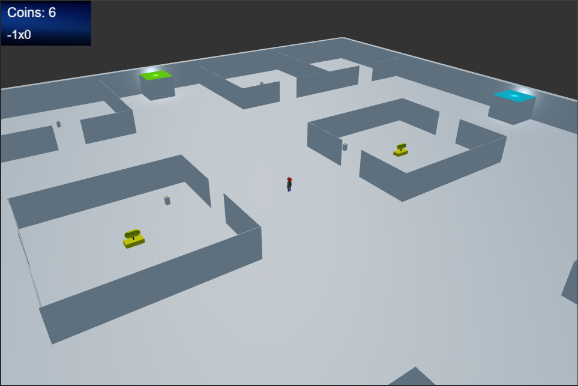
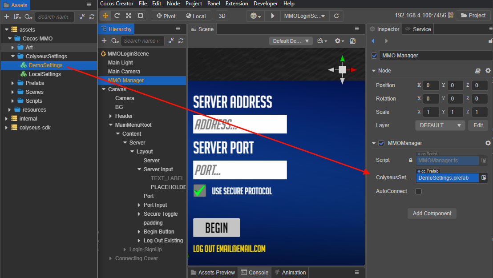

# MMO 技术展示

!!! requirement "前提"
    - Node.js v14.0 或更高版本
    - Colyseus 0.14.0
    - Cocos Creator 3.2.0
    - MongoDB 4.4.1 或更高版本

本技术演示旨在展示一种制作 **基础的** 大型多人游戏 (MMO) 的方法. 包括聊天系统, 玩家数据持久化, 多流程 ColyseusRooms 以及网络可交互对象. 需注意的是, 本演示 **不含** 商业化自动伸缩 MMO 游戏常见的分片技术及其他负载平衡方式. 本演示使用 Colyseus 0.14.0 版本以及 [Cocos Creator 版本 3.2.0](cocos-dashboard://download/2d_3.2.0).

**[下载演示源码](https://github.com/colyseus/cocos-demo-mmo/archive/master.zip)** ([查看源代码](https://github.com/colyseus/cocos-demo-mmo/))

[玩玩看!](https://kxb-tx.colyseus.dev/)



## 开始

如果您没有下载过 Cocos dashboard 可以到 [这里](https://download.cocos.com/CocosDashboard/v1.2.0/CocosDashboard-v1.2.0-win-050511.exe) 下载安装.

如何为 Cocos 引擎安装 Colyseus SDK 请参见 [这个教程](/getting-started/cocos-creator)

### 启动本地服务器

您需要以 **提供的 Server 目录** 安装并启用服务器来打开本演示. 本地运行服务器, 只要在控制台中输入以下命令:

```
cd Server
npm install
npm start
```

此外, 本演示使用 MongoDB 来实现玩家数据持久化. 本地运行的话, 需要您安装自己的本地数据库或者提供自己指定的的数据库 (参见 "调整演示" 章节)

[关于如何安装本地数据库, 可前往 MongoDB 网站查看](https://docs.mongodb.com/guides/server/install/)

### Colyseus 服务器配置

服务器的所有设置都可通过此处的 ColyseusSetting objects 进行修改:


本演示项目包含两个 settings objects. LocalSettings object 用于连接本地游戏服务器同时也是首次启动的默认配置.
如果您运行的是本地服务器, 默认的设置就能够满足需求; 但若您希望托管服务器, 则需要按需更改 **Colyseus 服务器地址** 和 **Colyseus 服务器端口**. DemoSettings object 就是用于连接在线服务器的.

如果要使用 `DemoSettings` object 只要把其 prefab 拖拽进 `MMOLoginScene` 场景中 MMO Manager 组件检视面板的 `ColyseusSettingsObject` 属性框中即可.



## 进入游戏

打开位于 `assets\Scenes\MMOLoginScene` 的场景 “MMOLoginScene”. 初次启动, 则需要输入您的 e-mail 和密码, 先创建一个账号, 然后再登录即可. 登录成功后, 客户端会加载 "TowerScene" 场景并将 NetworkedEntity 放入场景. 您可以随时按下 ESC键 查看控件, 自定义游戏人物或者退出到主菜单. 走进房间边缘的灰色方块时, 您就会被传送至另一个房间.

### 控制方法

本演示的控制按键可随时在 ESC菜单 中查看, 内容如下:

| 输入             | 描述     |
|----------------|--------|
| ESC            | 菜单     |
| W,A,S,M        | 移动     |
| 按住Shift键       | 冲刺     |
| Q,E            | 旋转人物   |
| Scroll Up/Down | 放大/缩小  |
| 按住并拖动鼠标右键 | 旋转摄像机  |
| `              | 切换聊天窗口 |


## 演示概览

本演示旨在向用户展示如何使用 Colyseus 来设计并实现一款 MMO 游戏. 它强调了以下特性:

### 动态房间

可按需创建和销毁 MMORooms. 当玩家进入一个区域时, 我们就让他进入相应的房间, 并将其 `progress` 值设为相应网格值, 就像 `arena.config.ts` 里的操作那样:

```javascript
gameServer.define("lobby_room", MMORoom).filterBy(["progress"]); // 根据 "progress" 值过滤房间 (这个值就是将要进入的网格值, 例如: -1x2)
```

当玩家在世界地图中移动时, 基于他们所在的网格位置让他们 加入/离开 相应房间. 玩家更新位置时, 客户端会向服务器端发送同步消息, 然后服务器端会在 `MMORoom.ts` 中得到玩家的位置:

```javascript
this.onMessage("transitionArea", (client: Client, transitionData: Vector[]) => {
    if (transitionData == null || transitionData.length < 2) {
        logger.error(`*** Grid Change Error! Missing data for grid change! ***`);
        return;
    }
    this.onGridUpdate(client, transitionData[0] as  Vector2, transitionData[1] as  Vector3);
});
```

在确定了新的网格位置之后，客户机将获得一个新的 SeatServation，用以加入更新位置后相应的的 ColyseusRoom. 登录/注册时也使用了类似的流程（请参考 <b>Player Persistence</b> 部分）.


这是本演示中使用的网格地图. 每个网格上四个大方向都互相连通, 以便从一个网格移动到另一个. 比如在网格空间 `0x0` 上, 可以向北(绿色) 出去进入网格空间 `0x1`. 所有相连网格空间都是互相连通的. 绿色 = 向北, 红色 = 向南, 蓝色 = 向东, 黄色 = 向西.

### 聊天系统


有一个 ColyseusRoom 来专门处理聊天系统: `ChatRoom.ts`. 不管是客户端还是服务端, 进入或离开一个 MMORoom 的同时也进入或离开了一个 ChatRoom. ChatRoom 用 `roomId` 过滤房间, 即与之对应的 MMORoom 的 ID.
客户端发送的消息会被添加到 ChatRoomState 的 ChatQueue, 给所有已连接的客户端触发一个 state change. 每一条新进消息都附加有 `timeStamp` 值, 消息触发后就会被移出队列.

### 玩家数据持久化

!!! tip "用户身份认证说明"
		本演示使用的是很基础的用户认证系统,
        目的是为演示玩家账号的数据持久化,
        该方法不应被照搬用于实际项目.
		请勿使用真实的邮箱和密码组合来注册演示账号.

在本演示中, 每个玩家的数据被记录到数据库中用来跟踪玩家的位置 (上次离开的房间和目前所在的房间), 坐标数据, 金币数目等等.
要建立数据档玩家需要运行游戏. 成功完成用户认证, 成功发送 seat reservation 至客户端. seat reservation 的 id 会作为该用户的 "pendingSessionId" 被保存至数据库中. 客户端消费这个 seat reservation 时, 房间的 "onAuth" 函数通过 "pendingSessionId" 查找玩家档案. 如果查找失败, 则不允许客户端进入房间. 查找到玩家账号后, "pendingSessionId" 将会转换为 "activeSessionId", 然后让客户端进入房间.
玩家数据的 progress 在 matchmaking 阶段被用以过滤房间. 比如, 某玩家 progress 值为 "1,1" (代表其在网格区域中坐标为 1x1) 的玩家将被匹配进入相应的已存在房间. 若不存在对应 progress 值的房间, 那么系统就创建一个. 因此, 对于每个网格, 只有当玩家在时才存在与其匹配的房间. 玩家通过任一网格出口离开自己所在的网格区域, 进入另一个网格时, 其 progress 将会被更新.

### 可交互元素


网格周围可能散落 `Interactables`. 这些是 `InteractableState` schema 对象在客户端的显现. 我们制作网格空间 prefab 时将它们放进去的. 玩家与其中一个对象互动时, 客户端会向服务器端发送一条 `objectInteracted` 消息. 若服务器端还没见过这个交互对象的 ID, 则会在房间的 schema map 里新建那么一个, 并回传给客户端. 然后服务器会判断该客户端是否具备交互的条件. 若是, 则广播一条 `objectUsed` 消息, 连同交互对象的 ID 以及与之交互的用户, 发送到所有客户端. 客户端上, 相应的 `NetworkedEntity` 和 `Interactable` 对象就会一起运行起来.
本演示中有 4 种不同类型的交互元素, 您可在各种网格空间中找到:
- Button Podium
    - 用户每按一次可获得 1枚硬币
- Coin Op
    - 一个小骑乘机, 会暂时禁止玩家控制, 同时把 NetworkedEntity 摇晃一阵. 每次使用消耗 1 枚金币
- Teleporter
    - 一个能够将把玩家传送至 "退出平台" 上的小机关. 使用消耗 1 枚金币

## 调整演示

当您把玩该演示的时候, 您可能希望进行一些调整, 帮您更好地了解各种机制. 下面您会学习到微调带来的效果.

### 使用您自己的数据库

如果您希望将此演示指向您自己的数据库, 您需要在 `Server` 目录下的 `arena.env` 中提供一个自己的 Mongo 数据库连接字符串, 默认连接的是一个本地的 Mongo 数据库:

```javascript
DEMO_DATABASE=mongodb://localhost:27017/demo?retryWrites=true&w=majority
```

### 聊天消息生命周期

在客户端, 您可以通过修改 `ChatManager.ts` 上的公开变量 `messageShowTime` 来更改消息显示的时长, 该变量会在 `MMOManager.ts` 处理进入/退出房间时, 发送给服务端:

```javascript
private async joinChatRoom() {
    let chatRoom: Colyseus.Room<ChatRoomState> = await this._client.joinOrCreate<ChatRoomState>('chat_room', {
        roomID: this.Room.id,
        messageLifetime: ChatManager.Instance.messageShowTime,
    });

    ChatManager.Instance.setRoom(chatRoom);
}
```

### 添加自定义交互对象

如果您想在客户端添加一个新的交互对象, 那么它必须继承 `Interactable.ts`. 参考其他交互对象, 考虑新对象应该做什么. 如果您想覆盖交互对象的 `serverType` 值, 那么还需要在服务端的 `interactableObjectFactory.ts` 里添加一个 `serverType` 的 case:

```javascript
export function getStateForType(type: string): InteractableState {
    let state: InteractableState = new InteractableState();
    //Any new types need an appropriate constructor in here or they will return empty
    switch (type) {
        case "DEFAULT": {
            state.assign({
                coinChange: 0,
                interactableType: type,
                useDuration: 5100.0,
            });
            break;
        }

        case "BUTTON_PODIUM": {
            state.assign({
                coinChange: 1,
                interactableType: type,
                useDuration: 10000.0,
            });
            break;
        }
        case "COIN_OP": {
            state.assign({
                coinChange: -1,
                interactableType: type,
                useDuration: 5100.0,
            });
            break;
        }
        case "TELEPORTER": {
            state.assign({
                coinChange: -2,
                interactableType: type,
                useDuration: 5100.0,
            });
            break;
        }
    }
    return state;
}
```

变量 `coinChange` 表示金币的改变情况. 如果该值为负 (交互时使用了金币) 服务器需要在给客户端返回扣款成功响应之前, 确认用户的金币是否够用, 就像 `MMORoom.ts` 里的 `handleObjectCost` 写的那样:

```javascript
handleObjectCost(object: InteractableState, user: NetworkedEntityState): boolean {
    let cost: number = object.coinChange;
    let worked: boolean = false;

    //Its a gain, no need to check
    if (cost >= 0) {
      user.coins += cost;
      worked = true;
    }
    //Check if user can afford this
    if (cost < 0) {
      if (Math.abs(cost) <= user.coins) {
        user.coins += cost;
        worked = true;
      }
      else {
        worked = false;
      }
    }

    return worked;
  }
```

如果检查通过, 交互对象就会正常运行.
变量 `useDuration` 用来表示交互对象在用户使用后将保持 `inUse` 状态多久. 当一个交互对象被使用时, 其 `availableTimestamp` 将做如下设定:

```javascript
interactableObject.inUse = true;
interactableObject.availableTimestamp =
    this.state.serverTime + interactableObject.useDuration;
```

然后服务器在每个 `simulationInterval` 中做如下检查:

```javascript
checkObjectReset() {
    this.state.interactableItems.forEach((state: InteractableState) => {
      if (state.inUse && state.availableTimestamp <= this.state.serverTime) {
        state.inUse = false;
        state.availableTimestamp = 0.0;
      }
    });
  }
```

对于 MMORoom 中的所有交互对象, 如果与 `serverTime` 比对超时, 则重置它的 `inUse` 值.
