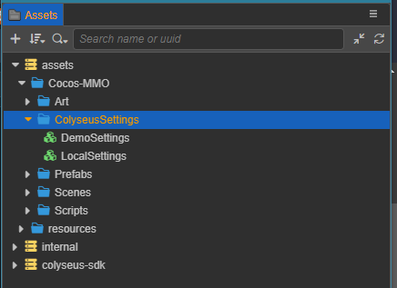

# MMO 技術展示

!!! requirement "前提"
    - Node.js v14.0 或更高版本
    - Colyseus 0.14.0
    - Cocos Creator 3.2.0
    - MongoDB 4.4.1 或更高版本

本技術演示旨在展示一種製作 **基礎的** 大型多人遊戲 (MMO) 的方法. 包括聊天系統, 玩家數據持久化, 多流程 ColyseusRooms 以及網絡可交互對象. 需註意的是, 本演示 **不含** 商業化自動伸縮 MMO 遊戲常見的分片技術及其他負載平衡方式. 本演示使用 Colyseus 0.14.0 版本以及 [Cocos Creator 版本 3.2.0](cocos-dashboard://download/2d_3.2.0).

**[下載演示源碼](https://github.com/colyseus/cocos-demo-mmo/archive/master.zip)** ([查看源代碼](https://github.com/colyseus/cocos-demo-mmo/))

[玩玩看!](https://kxb-tx.colyseus.dev/)


## 開始

如果您沒有下載過 Cocos dashboard 可以到 [這裏](https://download.cocos.com/CocosDashboard/v1.2.0/CocosDashboard-v1.2.0-win-050511.exe) 下載安裝.

如何為 Cocos 引擎安裝 Colyseus SDK 請參見 [這個教程](/getting-started/cocos-creator)

### 啟動本地服務器

您需要以 **提供的 Server 目錄** 安裝並啟用服務器來打開本演示. 本地運行服務器, 只要在控製臺中輸入以下命令:

```
cd Server
npm install
npm start
```

此外, 本演示使用 MongoDB 來實現玩家數據持久化. 本地運行的話, 需要您安裝自己的本地數據庫或者提供自己指定的的數據庫 (參見 "調整演示" 章節)

[關於如何安裝本地數據庫, 可前往 MongoDB 網站查看](https://docs.mongodb.com/guides/server/install/)

### Colyseus 服務器配置

服務器的所有設置都可通過此處的 ColyseusSetting objects 進行修改:



本演示項目包含兩個 settings objects. LocalSettings object 用於連接本地遊戲服務器同時也是首次啟動的默認配置.
如果您運行的是本地服務器, 默認的設置就能夠滿足需求; 但若您希望托管服務器, 則需要按需更改 **Colyseus 服務器地址** 和 **Colyseus 服務器端口**. DemoSettings object 就是用於連接在線服務器的.

如果要使用 `DemoSettings` object 只要把其 prefab 拖拽進 `MMOLoginScene` 場景中 MMO Manager 組件檢視面板的 `ColyseusSettingsObject` 屬性框中即可.


## 進入遊戲

打開位於 `assets\Scenes\MMOLoginScene` 的場景 「MMOLoginScene」. 初次啟動, 則需要輸入您的 e-mail 和密碼, 先創建一個賬號, 然後再登錄即可. 登錄成功後, 客戶端會加載 "TowerScene" 場景並將 NetworkedEntity 放入場景. 您可以隨時按下 ESC鍵 查看控件, 自定義遊戲人物或者退出到主菜單. 走進房間邊緣的灰色方塊時, 您就會被傳送至另一個房間.

### 控製方法

本演示的控製按鍵可隨時在 ESC菜單 中查看, 內容如下:

| 輸入             | 描述     |
|----------------|--------|
| ESC            | 菜單     |
| W,A,S,M        | 移動     |
| 按住Shift鍵       | 沖刺     |
| Q,E            | 旋轉人物   |
| Scroll Up/Down | 放大/縮小  |
| 按住並拖動鼠標右鍵 | 旋轉攝像機  |
| `              | 切換聊天窗口 |


## 演示概覽

本演示旨在向用戶展示如何使用 Colyseus 來設計並實現一款 MMO 遊戲. 它強調了以下特性:

### 動態房間

可按需創建和銷毀 MMORooms. 當玩家進入一個區域時, 我們就讓他進入相應的房間, 並將其 `progress` 值設為相應網格值, 就像 `arena.config.ts` 裏的操作那樣:

```javascript
gameServer.define("lobby_room", MMORoom).filterBy(["progress"]); // 根據 "progress" 值過濾房間 (這個值就是將要進入的網格值, 例如: -1x2)
```

當玩家在世界地圖中移動時, 基於他們所在的網格位置讓他們 加入/離開 相應房間. 玩家更新位置時, 客戶端會向服務器端發送同步消息, 然後服務器端會在 `MMORoom.ts` 中得到玩家的位置:

```javascript
this.onMessage("transitionArea", (client: Client, transitionData: Vector[]) => {
    if (transitionData == null || transitionData.length < 2) {
        logger.error(`*** Grid Change Error! Missing data for grid change! ***`);
        return;
    }
    this.onGridUpdate(client, transitionData[0] as  Vector2, transitionData[1] as  Vector3);
});
```

在確定了新的網格位置之後，客戶機將獲得一個新的 SeatServation，用以加入更新位置後相應的的 ColyseusRoom. 登錄/註冊時也使用了類似的流程（請參考 <b>Player Persistence</b> 部分）.


這是本演示中使用的網格地圖. 每個網格上四個大方向都互相連通, 以便從一個網格移動到另一個. 比如在網格空間 `0x0` 上, 可以向北(綠色) 出去進入網格空間 `0x1`. 所有相連網格空間都是互相連通的. 綠色 = 向北, 紅色 = 向南, 藍色 = 向東, 黃色 = 向西.

### 聊天系統


有一個 ColyseusRoom 來專門處理聊天系統: `ChatRoom.ts`. 不管是客戶端還是服務端, 進入或離開一個 MMORoom 的同時也進入或離開了一個 ChatRoom. ChatRoom 用 `roomId` 過濾房間, 即與之對應的 MMORoom 的 ID.
客戶端發送的消息會被添加到 ChatRoomState 的 ChatQueue, 給所有已連接的客戶端觸發一個 state change. 每一條新進消息都附加有 `timeStamp` 值, 消息觸發後就會被移出隊列.

### 玩家數據持久化

!!! tip "用戶身份認證說明"
		本演示使用的是很基礎的用戶認證系統,
        目的是為演示玩家賬號的數據持久化,
        該方法不應被照搬用於實際項目.
		請勿使用真實的郵箱和密碼組合來註冊演示賬號.

在本演示中, 每個玩家的數據被記錄到數據庫中用來跟蹤玩家的位置 (上次離開的房間和目前所在的房間), 坐標數據, 金幣數目等等.
要建立數據檔玩家需要運行遊戲. 成功完成用戶認證, 成功發送 seat reservation 至客戶端. seat reservation 的 id 會作為該用戶的 "pendingSessionId" 被保存至數據庫中. 客戶端消費這個 seat reservation 時, 房間的 "onAuth" 函數通過 "pendingSessionId" 查找玩家檔案. 如果查找失敗, 則不允許客戶端進入房間. 查找到玩家賬號後, "pendingSessionId" 將會轉換為 "activeSessionId", 然後讓客戶端進入房間.
玩家數據的 progress 在 matchmaking 階段被用以過濾房間. 比如, 某玩家 progress 值為 "1,1" (代表其在網格區域中坐標為 1x1) 的玩家將被匹配進入相應的已存在房間. 若不存在對應 progress 值的房間, 那麽系統就創建一個. 因此, 對於每個網格, 只有當玩家在時才存在與其匹配的房間. 玩家通過任一網格出口離開自己所在的網格區域, 進入另一個網格時, 其 progress 將會被更新.

### 可交互元素


網格周圍可能散落 `Interactables`. 這些是 `InteractableState` schema 對象在客戶端的顯現. 我們製作網格空間 prefab 時將它們放進去的. 玩家與其中一個對象互動時, 客戶端會向服務器端發送一條 `objectInteracted` 消息. 若服務器端還沒見過這個交互對象的 ID, 則會在房間的 schema map 裏新建那麽一個, 並回傳給客戶端. 然後服務器會判斷該客戶端是否具備交互的條件. 若是, 則廣播一條 `objectUsed` 消息, 連同交互對象的 ID 以及與之交互的用戶, 發送到所有客戶端. 客戶端上, 相應的 `NetworkedEntity` 和 `Interactable` 對象就會一起運行起來.
本演示中有 4 種不同類型的交互元素, 您可在各種網格空間中找到:
- Button Podium
    - 用戶每按一次可獲得 1枚硬幣
- Coin Op
    - 一個小騎乘機, 會暫時禁止玩家控製, 同時把 NetworkedEntity 搖晃一陣. 每次使用消耗 1 枚金幣
- Teleporter
    - 一個能夠將把玩家傳送至 "退出平臺" 上的小機關. 使用消耗 1 枚金幣

## 調整演示

當您把玩該演示的時候, 您可能希望進行一些調整, 幫您更好地了解各種機製. 下面您會學習到微調帶來的效果.

### 使用您自己的數據庫

如果您希望將此演示指向您自己的數據庫, 您需要在 `Server` 目錄下的 `arena.env` 中提供一個自己的 Mongo 數據庫連接字符串, 默認連接的是一個本地的 Mongo 數據庫:

```javascript
DEMO_DATABASE=mongodb://localhost:27017/demo?retryWrites=true&w=majority
```

### 聊天消息生命周期

在客戶端, 您可以通過修改 `ChatManager.ts` 上的公開變量 `messageShowTime` 來更改消息顯示的時長, 該變量會在 `MMOManager.ts` 處理進入/退出房間時, 發送給服務端:

```javascript
private async joinChatRoom() {
    let chatRoom: Colyseus.Room<ChatRoomState> = await this._client.joinOrCreate<ChatRoomState>('chat_room', {
        roomID: this.Room.id,
        messageLifetime: ChatManager.Instance.messageShowTime,
    });

    ChatManager.Instance.setRoom(chatRoom);
}
```

### 添加自定義交互對象

如果您想在客戶端添加一個新的交互對象, 那麽它必須繼承 `Interactable.ts`. 參考其他交互對象, 考慮新對象應該做什麽. 如果您想覆蓋交互對象的 `serverType` 值, 那麽還需要在服務端的 `interactableObjectFactory.ts` 裏添加一個 `serverType` 的 case:

```javascript
export function getStateForType(type: string): InteractableState {
    let state: InteractableState = new InteractableState();
    //Any new types need an appropriate constructor in here or they will return empty
    switch (type) {
        case "DEFAULT": {
            state.assign({
                coinChange: 0,
                interactableType: type,
                useDuration: 5100.0,
            });
            break;
        }

        case "BUTTON_PODIUM": {
            state.assign({
                coinChange: 1,
                interactableType: type,
                useDuration: 10000.0,
            });
            break;
        }
        case "COIN_OP": {
            state.assign({
                coinChange: -1,
                interactableType: type,
                useDuration: 5100.0,
            });
            break;
        }
        case "TELEPORTER": {
            state.assign({
                coinChange: -2,
                interactableType: type,
                useDuration: 5100.0,
            });
            break;
        }
    }
    return state;
}
```

變量 `coinChange` 表示金幣的改變情況. 如果該值為負 (交互時使用了金幣) 服務器需要在給客戶端返回扣款成功響應之前, 確認用戶的金幣是否夠用, 就像 `MMORoom.ts` 裏的 `handleObjectCost` 寫的那樣:

```javascript
handleObjectCost(object: InteractableState, user: NetworkedEntityState): boolean {
    let cost: number = object.coinChange;
    let worked: boolean = false;

    //Its a gain, no need to check
    if (cost >= 0) {
      user.coins += cost;
      worked = true;
    }
    //Check if user can afford this
    if (cost < 0) {
      if (Math.abs(cost) <= user.coins) {
        user.coins += cost;
        worked = true;
      }
      else {
        worked = false;
      }
    }

    return worked;
  }
```

如果檢查通過, 交互對象就會正常運行.
變量 `useDuration` 用來表示交互對象在用戶使用後將保持 `inUse` 狀態多久. 當一個交互對象被使用時, 其 `availableTimestamp` 將做如下設定:

```javascript
interactableObject.inUse = true;
interactableObject.availableTimestamp =
    this.state.serverTime + interactableObject.useDuration;
```

然後服務器在每個 `simulationInterval` 中做如下檢查:

```javascript
checkObjectReset() {
    this.state.interactableItems.forEach((state: InteractableState) => {
      if (state.inUse && state.availableTimestamp <= this.state.serverTime) {
        state.inUse = false;
        state.availableTimestamp = 0.0;
      }
    });
  }
```

對於 MMORoom 中的所有交互對象, 如果與 `serverTime` 比對超時, 則重置它的 `inUse` 值.
