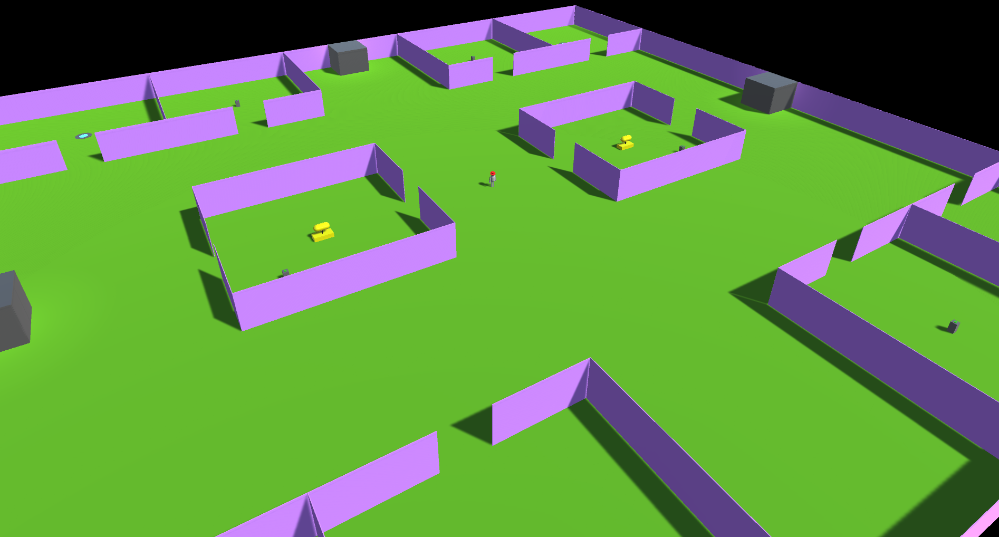


# MMO 技術演示

本技術演示旨在展示一種製作 **基礎的** 大型多人遊戲(MMO)的方法. 包括聊天系統, 玩家持久性, 多個流動 ColyseusRooms 以及聯網的可交互對象. 需註意的是,本演示包含生產大規模 MMO 所需的數據分區或其他任何負載平衡方式.本演示使用 Colyseus 0.14.7 版本以及 [Unity version 2020.3.1f1](https://unity3d.com/unity/qa/lts-releases).


**[下載演示](https://github.com/colyseus/unity-demo-mmo/archive/master.zip)** ([查看源代碼](https://github.com/colyseus/unity-demo-mmo/))


[玩下看看！](https://xey3jn.us-west-1.colyseus.dev/)



## 開始


### 啟用本地服務器

您需要從 **提供的服務器目錄** 中選擇安裝並啟用服務器,以正常操作本演示. 按照[這些文檔中 Unity3d 部分之"運行演示服務器"](/getting-started/unity3d-client/#running-the-demo-server)中的說明操作即可.

此外,本演示使用 MongoDB 來實現玩家信息持久性.若您希望在本地運行此示例,則需要安裝自己的本地數據庫或提供自己的(參見"演示調整"章節)

[關於如何設置本地示例的詳情,可前往 MongoDB 網站查看](https://docs.mongodb.com/guides/server/install/)

### ColyseusSettings ScriptableObject


服務器的所有設置都可通過此處的 ColyseusSetting ScriptableObject 進行更改：


如果您運行的是本地服務器,默認的設置就能夠滿足需求；但若您希望托管服務器,則需要按需更改 **Colyseus 服務器地址** 和 **Colyseus 服務器端口**.

## 播放演示

在位於 `ColyseusTechDemo-MMO\Assets\Scenes\MMOLoginScene` 的場景"MMOLoginScene"中登錄玩家賬號. 若您是初次操作,則需要創建一個賬號. 輸入您的郵箱地址和密碼,登錄後即可開始操作. 登錄成功後,客戶端會加載"TowerScene"場景並將 NetworkedEntity放入其中. 您可以隨時按下空格鍵查看控件,自定義遊戲人物或退出主菜單. 走進位於房間兩側的灰色方塊時, 您就會被傳送至另一間房.

### 控件
本演示的控件可隨時在 Escape 菜單查看, 內容如下：

| Input                            | Description        |
|----------------------------------|--------------------|
| W,A,S,M                          | 移動                |
| 按住Shift鍵                       | 沖刺                |
| Q,E                              | 旋轉人物            |
| 上滑/下滑                         | 放大/縮小           |
| 按住並拖動鼠標右鍵                 | 攝像頭軸轉           |
| `                                | 切換聊天窗口         |

## 演示概覽
本演示旨在向用戶展示如何使用 Colyseus 來設計並實現一款 MMO 遊戲.它強調了以下特性：
### 動態房間
可按需創建並配置 MMORooms.當玩家進入一個網格空間時,我們就加入一個房間,並將其`progress`值設為網格值,如  `arena.config.ts`:
```
javascript gameServer.define('lobby_room', MMORoom).filterBy(["progress"]); // Filter room by "progress" (which grid we're wanting to join EX: -1x2)
```
當玩家在地圖中移動時,可以基於他們所在的網格位置加入/離開房間.玩家嘗試更新遊戲進度時,客戶端會向服務器端發送一條消息,然後服務器端會在MMORoom.ts中捕捉這條信息：`MMORoom.ts`:
```javascript
this.onMessage("transitionArea", (client: Client, transitionData: Vector[]) => {
    if (transitionData == null || transitionData.length < 2) {
        logger.error(`*** Grid Change Error! Missing data for grid change! ***`);
        return;
    }
    this.onGridUpdate(client, transitionData[0] as  Vector2, transitionData[1] as  Vector3);
});
```
After determining what the new grid position is, the client is given a new SeatReservation to consume, thus joining the correct ColyseusRoom for their new grid position. A similar flow also occurs when Logging in/Signing up (see <b>Player Persistence</b> section).


這是本演示中使用的網格地圖.除綠色網格之外,其他網格都帶有互通出口,您可以在這些網格之間進出.比如在 `-3x3` 網格空間中,您可以通過西北方向的出口進入到 `3x-3` 網格空間.所有其他相連的網格之間都有互通出口.僅與角落有接觸的網格空間,其出口在角落上,玩家可以在對角線上穿梭.

### 聊天系統
 我們有另一個 ColyseusRoom 來處理聊天系統：`ChatRoom.ts`.不論是從哪裏(服務器端或客戶端)進入或離開 MMORoom,我們都會同時進入或離開 ChatRoom.這些聊天室均經過 `roomId` 篩選,後者與接入 MMORoom 的 ID 是一致的.客戶端發送的消息會被添加到 ChatRoomState's ChatQueue,觸發所有已連接的客戶端狀態變更.每一條新進消息都會收到一個 `timeStamp` 值,接收到後該信息就會被移出隊列.
### 玩家持久性
!!! tip "用戶身份認證說明"
    本演示使用的是很基礎的用戶認證體系, 目的是為了讓玩家能夠持續使用唯一的用戶賬號, 該方式不可用於真實場景去實現整體用戶身份認證.
    請勿使用任何您在其他地方真實使用的郵箱和密碼組合.

在本演示中,為記錄玩家的遊戲進度(玩家目前所在的房間以及離開遊戲前所在的房間), 所在位置, 遊戲幣余額等信息,玩家的唯一賬號會保留在數據庫中.
需要註冊玩家賬號才能播放本演示.成功認證用戶身份後,房間席位預定將回傳至客戶端.席位預定的會話 id 會作為"pendingSessionId"被保存至數據庫中玩家賬號條目中.客戶端嘗試使用席位預定時,房間的"onAuth"處理程序會執行玩家賬號查找操作,來讓玩家順利進入房間.若查找不到與"pendingSessionId"匹配的玩家賬號,客戶端則無法加入房間.但是在成功查找到玩家賬號後,"pendingSessionId"變為"activeSessionId",則玩家可加入房間.
匹配過程中玩家的遊戲進度將被用來過濾房間.比如,遊戲進度值為"1,1"(代表其在網格區域中坐標為 1x1)的玩家將被匹配進具有相同進度值的房間(若房間已存在).若不存在具有相同進度值的房間,則系統會自動創建一個.因此,只有當玩家在時才存在與其網格坐標匹配的房間.玩家通過任一網格出口離開網格區域,進入另一個網格時,其遊戲進度將會更新.
### 可交互元素
網格周圍可能會散落`Interactables`. 這些是 `InteractableState` 架構對象在客戶端的展示.我們製作新網格空間預製件時會將它們放入編輯器中.玩家與其中一個對象互動時,客戶端會向服務器端發送一條 `objectInteracted` 消息.若服務器端還未獲取到已提供的對象交互 ID,則會創建一個新的架構引用,將其添加至房間的架構映射中,並回傳給客戶端.然後服務器會客戶端是否具備執行互動的條件.若成功,所有客戶端將會收到一條 `objectUsed`廣播消息,包含交互對象的 ID 以及與之互動的用戶.客戶端上,適當的 `NetworkedEntity` 和 {7>Interactable<7} 對象則會被告知一起執行.本演示中有 4 種不同類型的交互元素,您可在不同的網格空間中找到：
-按鍵臺
- 用戶每按一次可獲得一枚硬幣
-投幣騎乘機
- 一個小騎乘機,可暫時禁用您的控件並來回彈跳晃動您的 NetworkedEntity.每次使用消耗 1 枚金幣
- 傳送器
    - 一個能夠將使用者傳送至其"退出平臺"的小平臺.使用時消耗 2 枚金幣
- 特效旋渦
    - 按鈕臺的替代品,沒有消耗也沒有作用,只在按下時顯示一個酷炫的特效(使用默認服務器類型)

## 調整演示

當你播放此演示的時候,你可能希望進行一些調整,幫你更好地了解當前發生的情況.下面你將學習如何進行微調整.

## Adjusting the Demo

As you play around with this demo, you may want to make some adjustments to better familiarize yourself with what is happening. Below, you’ll learn how to make these minor adjustments.

### 使用你自己的數據庫

如果你希望將此演示指向你自己的數據庫,你需要在 `Server` 目錄下的 `arena.env` 中提供一個不同的 Mongo 連接字符串,它當前期望你托管一個本地的 Mongo 數據庫：
``` javascript
DEMO_DATABASE=mongodb://localhost:27017/demo?retryWrites=true&w=majority
```

### 聊天消息顯示時間
在客戶端,你可以通過更改 `ChatManager.cs` 上的公共 `messageShowTime` 變量來更改消息顯示的時長,然後在 `MMOManager.cs`:
```csharp
private async void JoinChatRoom()
{
    ColyseusRoom<ChatRoomState> chatRoom = await client.JoinOrCreate<ChatRoomState>("chat_room", new Dictionary<string, object>() { { "roomID", Room.Id }, {"messageLifetime", ChatManager.Instance.messageShowTime} });
    ChatManager.Instance.SetRoom(chatRoom);
}
```

### 添加你自己的交互對象
如果你想向客戶端添加一個新的交互對象,其必須繼承自 `Interactable.cs`.查看其他交互對象,想想你可以做什麽.如果你想重寫你的交互對象的 `serverType` 值,你也應當為你在服務器上的新 `serverType`  添加一個案例： `interactableObjectFactory.ts`:
```javascript
export  function  getStateForType(type: string) : InteractableState {
	let  state : InteractableState = new  InteractableState();
	//Any new types need an appropriate constructor in here or they will return empty
	switch(type){
		case("DEFAULT"):
		{
			state.assign({
				coinChange :  0,
				interactableType :  type,
				useDuration :  5100.0
			});
			break;
		}

		case("BUTTON_PODIUM"):
		{
			state.assign({
				coinChange :  1,
				interactableType :  type,
				useDuration :  10000.0
			});
			break;
		}
		case("COIN_OP"):
		{
			state.assign({
				coinChange : -1,
				interactableType :  type,
				useDuration :  5100.0
			});
			break;
		}
		case("TELEPORTER"):
		{
			state.assign({
				coinChange : -2,
				interactableType :  type,
				useDuration :  5100.0
			});
			break;
		}
	}
	return  state;
}
```
變量 `coinChange` 是在使用金幣時用戶的金幣數量應該改變的數值.如果該值為負(金幣使用的交互成本)服務器將在成功響應之前確認用戶擁有足夠金幣,如函數中所示 `handleObjectCost` in `MMORoom.ts`:
``` javascript
handleObjectCost(object: InteractableState, user: NetworkedEntityState): boolean {
    let cost: number = object.coinChange;
    let worked: boolean = false;

    //Its a gain, no need to check
    if (cost >= 0) {
      user.coins += cost;
      worked = true;
    }
    //Check if user can afford this
    if (cost < 0) {
      if (Math.abs(cost) <= user.coins) {
        user.coins += cost;
        worked = true;
      }
      else {
        worked = false;
      }
    }

    return worked;
  }
```
如果該檢查成功, 目標交互將正常繼續進行.
變量 `useDuration` 是用來考慮交互對象在於用戶交互後能夠保持 `inUse` 多久的因素. 當一個交互對象被使用後,其 `availableTimestamp` 將被設定為：
``` javascript
interactableObject.inUse = true;
interactableObject.availableTimestamp = this.state.serverTime + interactableObject.useDuration;
```
服務器之後將檢查每個 `simulationInterval`:
``` javascript
checkObjectReset() {
    this.state.interactableItems.forEach((state: InteractableState) => {
      if (state.inUse && state.availableTimestamp <= this.state.serverTime) {
        state.inUse = false;
        state.availableTimestamp = 0.0;
      }
    });
  }
```
如果 `serverTime` 顯示時機已到, 這將重置  MMORoom 中任何交互對象的 `inUse` 值.
