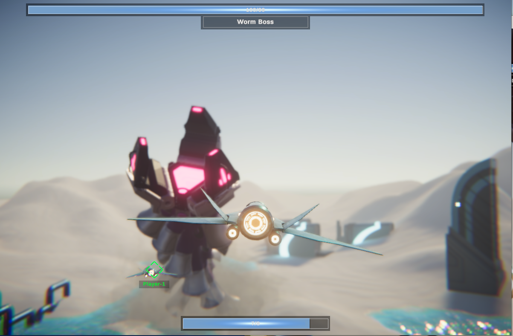
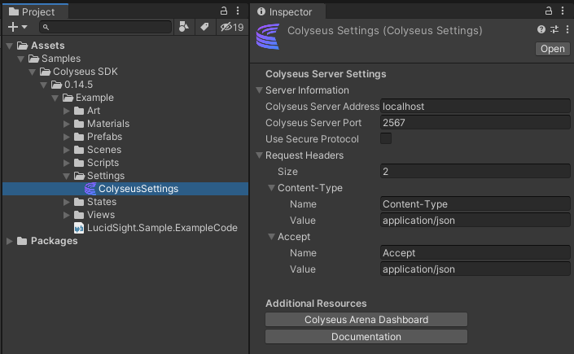

# Starboss 技術演示
該示例以 [Unity Procedural Boss Demo](https://www.youtube.com/watch?v=LVSmp0zW8pY) [(源代碼參見這裏)](https://on.unity.com/37K5j1b) 作為基礎, 由我們的團隊將其轉化了為帶有兩種不同遊戲模式的多人在線遊戲.

本技術演示的目的在於展示如何將一個現有的單人遊戲項目轉化為一個完整的, 多人在線的遊戲生命周期. 該演示設計使用 Colyseus 0.14.7 版本以及 [Unity version 2020.1.5f1](https://unity3d.com/unity/qa/lts-releases).

**[下載演示源碼](https://github.com/colyseus/unity-demo-starboss/archive/main.zip)** ([在線查看源代碼](https://github.com/colyseus/unity-demo-starboss/))

[玩玩看!](https://sac-dt.colyseus.dev/)



## 開始

### 啟動本地服務器

您需要以 **提供的 Server 目錄** 安裝並啟用服務器來打開本演示. 按照 [這些文檔中 Unity3d 部分的 "運行演示服務器"](/getting-started/unity3d-client/#running-the-demo-server) 中的說明操作即可.

### ColyseusSettings ScriptableObject

服務器的所有設置都可通過此處的 ColyseusSetting ScriptableObject 進行修改:



如果您運行的是本地服務器, 默認的設置就能夠滿足需求; 但若您希望托管服務器, 則需要按需更改 **Colyseus 服務器地址** 和 **Colyseus 服務器端口**.

### 進入遊戲

打開位於 `Assets\StarBoss\Scenes\StarBossLobby` 的場景 "StarBossLobby" 進入遊戲. 輸入您的用戶名然後創建房間開始遊戲. **如果您無法進入創建房間界面, 請確認本地服務器運行正常, 並核查 Unity 編輯器的錯誤日誌.** 如果一切順利, 客戶端將加載 "Scene_Dev_Environment" 場景. 如果您按下 Enter 鍵或者點擊 「Start」 按鈕, 您將進入 "準備就緒" 狀態, 然後遊戲將會開始. 如果您想等待更多玩家加入, 必須等所有玩家都 "準備就緒" 後遊戲才會開始. 如果您創建了 Team Deathmatch 房間, 則至少需要再有 1 名玩家加入另一邊的隊伍, 之後遊戲才能開始.

## 演示概覽

### 創建並列出不同遊戲模式的房間
在客戶端 `StarBossLobbyController.cs` 裏被覆蓋的 `CreateRoom` 函數中, 您會看到我們是在哪裏做出的, 該啟動合作模式房間還是對戰模式房間的決定:
```csharp
string gameModeLogic = coopToggle.isOn ? "starBossCoop" : "starBossTDM";
roomOptions = new Dictionary<string, object> {{"logic", gameModeLogic }, { "scoreToWin", 3 } };
LoadMainScene(() => { ExampleManager.Instance.CreateNewRoom(selectRoomMenu.RoomCreationName, roomOptions);
```
在服務器端的 `StarBossRoom.ts` 裏我們收到這些 `roomOptions` 並使用  `logic` 成員來決定該創建哪種類型的房間:
```javascript
// 取得房間的自定義邏輯
const  customLogic = await  this.getCustomLogic(options["logic"]);
if(customLogic == null) logger.debug("NO Custom Logic Set");
try{
	if(customLogic != null) {
		this.setMetadata({isCoop:  options["logic"] == "starBossCoop" });
		customLogic.InitializeLogic(this, options);
	}
}
catch(error){
	logger.error("Error with custom room logic: " + error);
}
```
這一行:
```javascript
this.setMetadata({isCoop:  options["logic"] == "starBossCoop" });
```
我們在房間元數據中為 `isCoop` 賦值, 這樣我們就可以在客戶端使用該值以顯示相應的房間類型.

為做到這一點, 我們在客戶端創建了一個包含 `isCoop` 值的可序列化類 `StarBossRoomMetaData.cs`. 之後會在我們自定義的 `StarBossRoomAvailable` 中使用此類, 它繼承自 `ColyseusRoomAvailable`:
```csharp
[System.Serializable]
public class StarBossRoomAvailable : ColyseusRoomAvailable {
    public StarBossRoomMetaData metadata;
}
```
之後在 `ExampleManager.cs` 裏我們已經更新了 `GetAvailableRooms` 函數用來接收 `StarBossRoomAvailable` 類型的數據:
```csharp
public async void GetAvailableRooms() {
    StarBossRoomAvailable[] rooms = await client.GetAvailableRooms<StarBossRoomAvailable>(_roomController.roomName);
    onRoomsReceived?.Invoke(rooms);
}
```
我們還更新了 `OnRoomsReceived` 委托調用來使用 `StarBossRoomAvailable`. 最後, 對於收到的每個條目, 我們實例化一個附加有 `RoomListItem` 組件的對象, 然後將可用房間的引用傳給它. 在 `RoomListItem.cs` 的函數 `DetermineMode` 中:
```csharp
bool isCoop = roomRef.metadata.isCoop;

if (isCoop) {
    roomName.text = roomRef.roomId;
    gameMode.text = "Co-op";
    gameMode.color = coopColor;
    backgroundImage.color = coopColor;
}
else {
    roomName.text = roomRef.roomId;
    gameMode.text = "Team Deathmatch";
    gameMode.color = deathmatchColor;
    backgroundImage.color = deathmatchColor;
}
```
最終結果如圖所示:


## 調整演示

當您把玩該演示的時候, 您可能希望進行一些調整, 幫您更好地了解各種機製. 下面您會學習到微調帶來的效果.

### Team Deathmatch 模式勝利得分

在客戶端 `StarBossLobbyController.cs` 裏被覆蓋的 `CreateRoom` 中設置了對戰模式取得勝利得分最大值為 3:
```csharp
roomOptions = new Dictionary<string, object> {{"logic", gameModeLogic }, { "scoreToWin", 3 } };
LoadMainScene(() => { ExampleManager.Instance.CreateNewRoom(selectRoomMenu.RoomCreationName, roomOptions);
```

在服務器端, 我們收到這些 `roomOptions` 並用以初始化遊戲邏輯. 只有在初始化對戰房間時, 我們才用得著 `scoreToWin` 配置項, 用法如 `starBossTDM.js` 裏那樣:
```javascript
roomRef.tdmScoreToWin = options["scoreToWin"] ? Number(options["scoreToWin"]) : 10;
```
