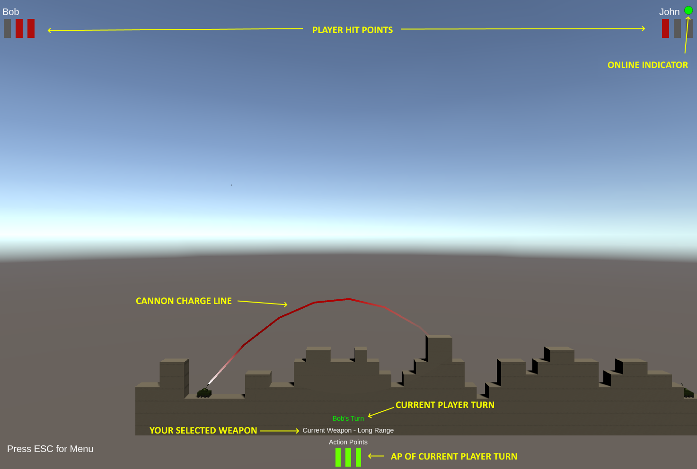

# 回合製坦克演示

本演示的目的是提供一個方法將 Colyseus 作為異步, 回合製遊戲的引擎.
該演示設計時使用了 Colyseus 0.14.7 版本以及 [Unity version 2019.4.20f1](https://unity3d.com/unity/qa/lts-releases).

**[下載演示源碼](https://github.com/colyseus/unity-demo-tanks/archive/main.zip)** ([在線查看源代碼](https://github.com/colyseus/unity-demo-tanks/))

[玩玩看!](https://xcdazr.colyseus.dev/)


## 開始

### 啟動本地服務器

您需要以 **提供的 Server 目錄** 安裝並啟用服務器來打開本演示. 按照 [這些文檔中 Unity3d 部分的 "運行演示服務器"](/getting-started/unity3d-client/#running-the-demo-server) 中的說明操作即可.

### ColyseusSettings ScriptableObject

服務器的所有設置都可通過此處的 ColyseusSetting ScriptableObject 進行修改:


如果您運行的是本地服務器, 默認的設置就能夠滿足需求; 但若您希望托管服務器, 則需要按需更改 **Colyseus 服務器地址** 和 **Colyseus 服務器端口**.

## 演示概覽

### 房間元數據

本演示使用了房間的元數據, 連同玩家用戶名一起跟蹤遊戲內的玩家. 當一名玩家進入或創建一個房間時, 其用戶名將被存儲在一個名為 `team0` 或 `team1` 的屬性中, `team0` 代表了是這名玩家創建的房間, `team1` 代表這名玩家加入了已創建的房間作為挑戰者.
``` javascript
this.metadata.team0
this.metadata.team1

this.setMetadata({"team0": options["creatorId"]});

```

元數據裏設置的用戶名將用於過濾要在大廳中顯示的可用房間. 在大廳裏的用戶能夠看到他們創建的所有房間, 或者看到那些房主在等待挑戰者加入的房間. 非由您創建的房間和已有兩名玩家的漫客房間則不會被顯示在大廳之中.

``` csharp
private TanksRoomsAvailable[] TrimRooms(TanksRoomsAvailable[] originalRooms)
{
    List<TanksRoomsAvailable> trimmedRooms = new List<TanksRoomsAvailable>();
    for (int i = 0; i < originalRooms.Length; ++i)
    {
        //Check a rooms metadata. If its one of our rooms OR waiting for a player, we show it
        TanksRoomMetadata metadata = originalRooms[i].metadata;
        if (metadata.team1 == null || (metadata.team1.Equals(ExampleManager.Instance.UserName) ||
                                       metadata.team0.Equals(ExampleManager.Instance.UserName)))
        {
            trimmedRooms.Add(originalRooms[i]);
        }
    }

    return trimmedRooms.ToArray();
}
```


### 保持房間存在

為了使這個演示成為一個異步的回合製遊戲, 我們需要保持房間的存在狀態, 即使是在雙方玩家都離開房間之後. 通過將 `autoDispose` 標誌設為 false, 該房間將繼續保持存在狀態. (您可以在服務端代碼 TanksRoom 中的 onCreate 處理程序中看到這個設定).

``` javascript
this.autoDispose = false;
```

我們知道, 斷開房間要在檢查確定房間是否應該被關閉後, 再檢查在布爾標誌 `inProcessOfQuitingGame` 是否為 true 之後才能斷開房間. 當一名用戶離開遊戲時會執行這些檢查.
``` javascript

// 檢查創作者是否在其他人加入之前就已經退出了
if(this.metadata.team0 && this.metadata.team1 == null) {
    disconnectRoom = true;
}

// 房間裏沒有其他用戶, 所以斷開連接
if(this.inProcessOfQuitingGame && this.state.networkedUsers.size <= 1 && this.connectedUsers <= 1) {
    disconnectRoom = true;
}

// 房間是否應該斷開連接?
if(disconnectRoom) {
    this.disconnect();
}
```

### 暫停房間

由於這是一個異步遊戲的示例, 我們的房間可能呈現某段時間內沒有連入用戶的狀態. 當沒有用戶連接至房間時, 服務器不需要更新模擬遊戲循環.
當用戶斷開與房間的連接時, 將執行檢查以確定房間是否沒人了. 當房間裏沒人時, 將給模擬遊戲循環時鐘設置一個很大的延遲值以達到暫停模擬遊戲循環的目的. 在本示例中, 該值略大於 24 天.
``` javascript

// 在房間的 `onLeave` 處理程序中
// 檢查服務器是否應該暫停模擬循環,因為
// 沒有用戶連接到房間
let anyConnected: boolean = false;
this.state.players.forEach((player, index) => {
    if(player.connected) {
        anyConnected = true;
    }
});

if(anyConnected == false) {
    // 沒有用戶連接,所以暫停服務器更新
    this.setServerPause(true);
}


private setServerPause(pause: boolean) {

    if(pause) {
        this.setSimulationInterval(dt => this.gameLoop(dt), this.pauseDelay);
    }
    else {
        // 設置模擬間隔回調
        this.setSimulationInterval(dt => this.gameLoop(dt));
    }

    this.serverPaused = pause;
}
```

當用戶重新加入被暫停的房間時, 模擬間隔會被恢復.
``` javascript

// 在房間的 `onJoin` 處理程序中
// 檢查服務器是否需要解除暫停狀態
if(this.serverPaused) {
    // 服務器目前處於暫停狀態, 因為有玩家連入, 所以解除暫停狀態
    this.setServerPause(false);
}
```

### 進入遊戲

打開位於 `Assets\TurnBasedTanks\Scenes\TanksLobby` 的場景 "TanksLobby" 進入遊戲. 輸入您的用戶名然後創建房間開始遊戲. **如果您無法進入創建房間界面, 請確認本地服務器運行正常, 並核查 Unity 編輯器的錯誤日誌.** 如果一切順利, 客戶端將加載 "TankArena" 場景. 

- 本演示為異步回合製遊戲.

- 您可以隨時離開房間, 之後返回進行中的遊戲時, 將從最後離開的地方繼續.

- 一局遊戲中只能有兩名玩家.

- 遊戲目的是摧毀對手的坦克.

- 每名玩家有 3 點生命值, 顯示在屏幕上方角落.

- 當您創建一個房間時, 您可以立即開始您的回合, 無論是否已經有另一名玩家加入.

- 所有控製選項都顯示在了 **ESC** 菜單中.

- 您可以使用 ESC 菜單中的退出選項隨時離開房間, 也可以向您的對手投降.

- 您的回合開始時有 3 個行動點數. 向左/右移動消耗 **一個** 行動點數, 開火消耗 **兩個** 行動點數.

- 移動可以被過高的地形所阻擋.

- 想要發射坦克的武器時, 單擊鼠標左鍵並長按來為射擊充能. 松開左鍵進行開火.

- 您有 3 種射程不同的武器可供選擇. 使用數字鍵 1-3 來選擇武器.

- 在每次移動或開火行動後有 2 秒延遲, 之後才能進行下一次行動.

- 在一名玩家的坦克損毀或有人投降時遊戲結束, 遊戲結束菜單顯示勝/負消息, 並展示兩個選項: 再來一局或退出遊戲. 如果另一名玩家在您離開前要求再來一局, 您的遊戲結束菜單上將顯示這個消息.

- 您的對手名稱旁邊會有一個 "在線標誌", 來顯示其是否與您同時處於房間內.
    - **紅色** = 離線
    - **綠色** = 在線

- 可以通過按下空格鍵來跳過您剩余的回合.




## 調整演示

當您把玩該演示的時候, 您可能希望進行一些調整, 幫您更好地了解各種機製. 下面您會學習到微調帶來的效果.

### 遊戲規則和武器數據

**Game Rules** 和 **Weapon Data** 的值都可以在服務端代碼的 `ArenaServer\src\rooms\tanks\rules.ts` 中找到. **Game Rules** 控製移動和開火的行動點數消耗以及玩家擁有多少行動點數. `weaponList` 裏的數據詳細規定了每種武器的最大充能, 充能時間, 影響半徑和武器威力.

```javascript
const GameRules = {
    MaxActionPoints: 3,
    MovementActionPointCost: 1,
    FiringActionPointCost: 2,
    ProjectileSpeed: 30,
    MaxMovement: 3,
    MaxHitPoints: 3,
    MovementTime: 2,
}

const weaponList = [
    {
        name: "Short Range",
        maxCharge: 5,
        chargeTime: 1,
        radius: 1,
        impactDamage: 1,
        index: 0
    },
    {
        name: "Mid Range",
        maxCharge: 8,
        chargeTime: 2,
        radius: 1,
        impactDamage: 1,
        index: 1
    },
    {
        name: "Long Range",
        maxCharge: 10,
        chargeTime: 5,
        radius: 1,
        impactDamage: 1,
        index: 2
    }
]

```
