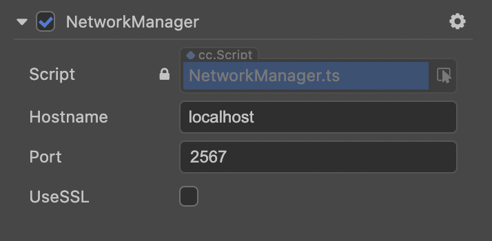
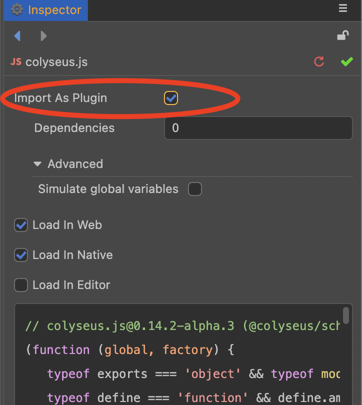

# Cocos Creator 3

[Cocos Creator](https://cocos.com/creator) 是跨平臺 2D/3D 遊戲開發工具.

Colyseus SDK 在 Cocos Creator 的運用上與 [JavaScript SDK](https://docs.colyseus.io/getting-started/javascript-client/) 類似. 主要區別在於如何通過 Cocos Creator 的 [TypeScript 組件來引入服務](https://docs.colyseus.io/colyseus/getting-started/cocos-creator/#importing-from-the-extension).

!!! tip "想要具體實例?"
看看 [Tic Tac Toe 項目](https://github.com/colyseus/cocos-demo-tictactoe).

#### 1. 安裝擴展插件

- 打開 [Cocos Store](https://store.cocos.com/app/en/detail/2937/) (菜單: "擴展" &raquo; "商店")
- 搜索 "Colyseus SDK"
- 下載擴展插件
- 將下載的 zip 包解壓到 "<項目目錄>/extensions/" 文件夾下
  
- 啟動 Cocos Creator, 打開擴展管理器 (菜單: "擴展" » "擴展管理器")
- 在 "項目" 頁上點擊 "掃描插件" 按鈕
- 激活找到的 "colyseus-sdk" 插件
  


## 2. 更新 `tsconfig.json` 文件

確認 `"compilerOptions"` 類目下有 `"esModuleInterop": true`:

```json
  // ...

  /* Add your custom configuration here. */
  "compilerOptions": {
    // ...
    "esModuleInterop": true
    // ...
  }
  // ...
```

重新啟動 Cocos Creator.

## 3. 導入擴展插件

根據路徑導入 Colyseus 擴展插件:

```typescript
import Colyseus from 'db://colyseus-sdk/colyseus.js';
```

下面給出一個更詳細的示例方便大家應用於自己的項目之中.

把如下內容命名為 `NetworkManager.ts` 存入項目的 `assets` 文件夾裏.

```typescript
import { _decorator, Component, Node } from 'cc';
const { ccclass, property } = _decorator;

import Colyseus from 'db://colyseus-sdk/colyseus.js';

@ccclass('NetworkManager')
export class NetworkManager extends Component {
    @property hostname = "localhost";
    @property port = 2567;
    @property useSSL = false;

    client!: Colyseus.Client;
    room!: Colyseus.Room;

    start () {
        // Instantiate Colyseus Client
        // connects into (ws|wss)://hostname[:port]
        this.client = new Colyseus.Client(`${this.useSSL ? "wss" : "ws"}://${this.hostname}${([443, 80].includes(this.port) || this.useSSL) ? "" : `:${this.port}`}`);

        // Connect into the room
        this.connect();
    }

    async connect() {
        try {
            this.room = await this.client.joinOrCreate("my_room");

            console.log("joined successfully!");
            console.log("user's sessionId:", this.room.sessionId);

            this.room.onStateChange((state) => {
                console.log("onStateChange: ", state);
            });

            this.room.onLeave((code) => {
                console.log("onLeave:", code);
            });

        } catch (e) {
            console.error(e);
        }
    }
}
```

然後就可以把 NetworkManager 作為組件安放在 Cocos Creator 的任意節點上.

因為上面用到了 @property 裝飾詞, 所以 hostname, port 和 useSSL 這些變量都可以在 Cocos Creator 中修改:




----

#### 另一種方法: 手動將 colyseus.js 文件導入項目 (不使用擴展插件)

- [從 GitHub 上下載最新版 `colyseus-js-client.zip`](https://github.com/colyseus/colyseus.js/releases).

- 把 `colyseus-js-client.zip` 裏的文件解壓到 `assets/` 文件夾裏.
- 把 `colyseus.js` 和 `colyseus.d.ts` 文件移動到 Cocos Creator 項目的 `scripts` 文件夾裏.
- 在資源面板點擊 `colyseus.js`, 開啟 "Import As Plugin" (詳見下文圖片)
- **TypeScript**: 使用 `import Colyseus from "./colyseus.js";` 引入
- **JavaScript**: 使用 `const Colyseus = require("./colyseus.js");` 引入


