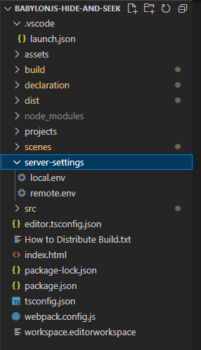
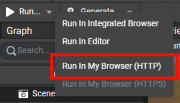

# Hide and Seek 技术演示

## Technical Requirements
- Node.js v14.0 或更高版本
- Colyseus 0.14.20
- Colyseus Client SDK 0.14.13
- Babylon.js Editor 4.4.0 或更高版本

## Introduction
本技术演示旨在展示 Colyseus 如何与 Babylon.js Editor 配合使用. 以下文档涵盖从安装到使用 Colyseus SDK 连接本地 Colyseus 服务器的方法. 本演示使用 Colyseus 0.14.20 版本以及 [Babylon.js Editor 版本 4.4.0](http://editor.babylonjs.com/){target=_blank}.
演示游戏名叫 "Hide and Seek", 游戏中玩家被随机赋予躲藏者 (幽灵) 或者追捕者 (南瓜头) 的角色. 躲藏者躲避追捕者的追捕直到游戏倒计时结束即可获得胜利.

**[下载演示](https://github.com/colyseus/babylonjs-hide-and-seek/archive/master.zip)** ([查看源码](https://github.com/colyseus/babylonjs-hide-and-seek/){target=_blank})

**[玩玩看](https://bppuwh.colyseus.dev/){target=_blank}**


## 开始

### Colyseus SDK/Framework
必须从 **提供的 Server 目录** 安装启动服务器以便演示游戏顺利运行. 
要启动本地服务器, 在控制台输入以下命令即可:

```
cd Server
npm install
npm start
``` 

!!! note "注意"
    - 必须先安装服务器再从编辑器中打开或运行游戏项目不然项目编译会报错. 这是因为出于开发便捷的目的, 客户端代码要从服务端引用一些类.
    - 在用 Babylon.js Editor 打开游戏项目时, 在 **Server** 文件夹里会自动从 `.ts` 源文件生成相应的 `.js` 文件. 而当本地服务器 (使用用 `npm start`) 启动时, 这些 `.js` 文件会被删除以免造成运行时报错.

#### Colyseus 客户端 SDK
对于本例而言您无需关心 Colyseus 客户端 SDK 的安装问题, 因为 Babylon.js Editor 会依据其工作目录下的 `package.json` 文件自动安装. 需要的话, 在 Babylon.js Editor 里手动安装 Colyseus 客户端 SDK 的方法详见 [这里](../../getting-started/babylonjs-editor.md){target=_blank}.

### Colyseus 服务器配置
存放服务器配置的 `.env` 文件位于 Babylon.js Editor 工作目录下:



如果使用本地服务器, 使用 `local` 配置即可. 但当使用远程服务器的时候, 就需要配置好相应的 **Colyseus 服务器地址** 和 **Colyseus 服务器端口**. 例如 remote 配置文件就包含了本演示游戏在 Arena 上的配置信息.
编辑器默认从 `local.env` 文件中读取配置值.

## 进入游戏


使用编辑器打开工作目录就应该自动加载好这个唯一的场景. 点击编辑器左上角的 "Play" 按钮就会开启一个播放窗口. 创建游戏房间或者加入已存在的游戏房间只要点击 "Quick Play" 按钮即可. 然后会显示 "Joining..." 提示, 连接成功后提示消失并显示出大厅界面.
默认最少3名玩家加入即可开始游戏, 如下文所示该值是可调整的. 必要的话可以打开多个客户端以模拟多人对战.

!!! tip "提示"
    - 在浏览器运行客户端的性能要高于编辑器的嵌入式浏览器 (在编辑器中右键点击 "Run" 按钮) 

    

    - 如果未能成功进入大厅请检查本地服务器运行状况及编辑器日志报错.


### 控制方法
玩家移动: W, A, S, D 键.

### 游戏玩法
- 追捕者和躲藏者都出现在墓园前的中心位置
- 每轮游戏持续 60 秒钟. 剩余时间在屏幕左上角显示

#### Seeker:
- 如果计时结束前追捕者找到所有躲藏者, 则追捕者获胜
- 躲藏者被捉到前, 不能被追捕者直接看到
- 有一些花招陷阱, 把躲藏者的的位置提示给追捕者, 点亮隐藏区域
    - 泥沼使得玩家移动时留下一串脚印, 持续显示一段时间
    - 安住的追捕者魂会被躲藏者惊扰到
    - 休息的蝙蝠会被躲藏者惊扰到

#### Hider:
- 在追捕者开始追捕前, 躲藏者有 3 秒钟时间逃跑躲藏
- 如果计时结束至少有 1 名躲藏者没被找到, 则躲藏者获胜
- 如果躲藏者出现在追捕者的视野里或者离追捕者太近就会被捉到
    - 视野范围 60 度, 长 7 米
- 被捉到的躲藏者无法移动
    - 会在其足部用高亮铁链标识出来
- 被捉住的躲藏者有一次机会被其他躲藏者救活
    - 救躲藏者只需站在他旁边 1 秒钟即可

## 调整游戏
玩过这个游戏之后, 您可能希望按自己喜好对游戏做一些调整. 下面来解释如何对游戏进行微调. 绝大多数变量都保存在 **Server** 文件夹下的 `Server/src/gameConfig.ts` 文件中.


### 玩家限制
`minPlayers` 表示游戏所需最少躲藏者数. `maxPlayers` 表示游戏房间可以进入的最多躲藏者数. 本例中每个房间最多 8 名玩家. 可以减少这个数量, 增大到超过 8 则会报错.

### 玩家移动
有两个值影响着玩家移动速度. 基本移动速度 `playerMovementSpeed` 作用于追捕者和躲藏者所有玩家. 追捕者还有一个速度加成 `seekerMovementBoost` 默认设置为 `1.2`. 在速度加成影响下追捕者可以以 1.2 倍速 (也就是比躲藏者快 20%) 移动.

### 追捕者的视野
追捕者的追捕能力基于他的视野 (FOV) 和视距. 这两个值分别保存为 `seekerFOV` 和 `seekerCheckDistance` 变量.

### 营救玩家
有两个变量涉及玩家营救. 一个是 `rescueDistance` 用来控制营救者与被抓者的有效营救距离; 另一个是 `rescueTime` 代表营救时间, 以毫秒为单位.

### 倒计时
有许多倒计时可以调整; 每个倒计时以 `Countdown` 作为变量后缀影响着游戏状态. 倒计时都是以毫秒为单位:


- `preRoundCountdown`: 从房间达到最少有效躲藏者数开始, 到锁定房间并开始游戏的倒计时. 
- `initializedCountdown`: 服务器初始化好一轮游戏的房间之后的一小段时间, 用于让服务端接收并更新 schemas 以及玩家们的初始化操作.
- `prologueCountdown`: 追捕者抓躲藏者之前的总时长. 与 scatter countdown 一起使用. 留给玩家的角色反应时间是 `prologueCountdown - scatterCountdown`
- `scatterCountdown`: 留给玩家逃跑躲藏的时长.
- `huntCountdown`: 一轮游戏时长; 即留给追捕者捉躲藏者的时长.
- `gameOverCountdown`: 游戏结束后显示提示的时长.
