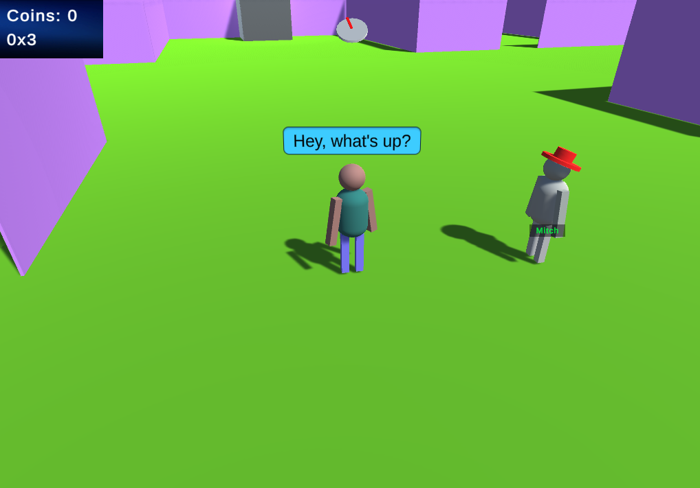
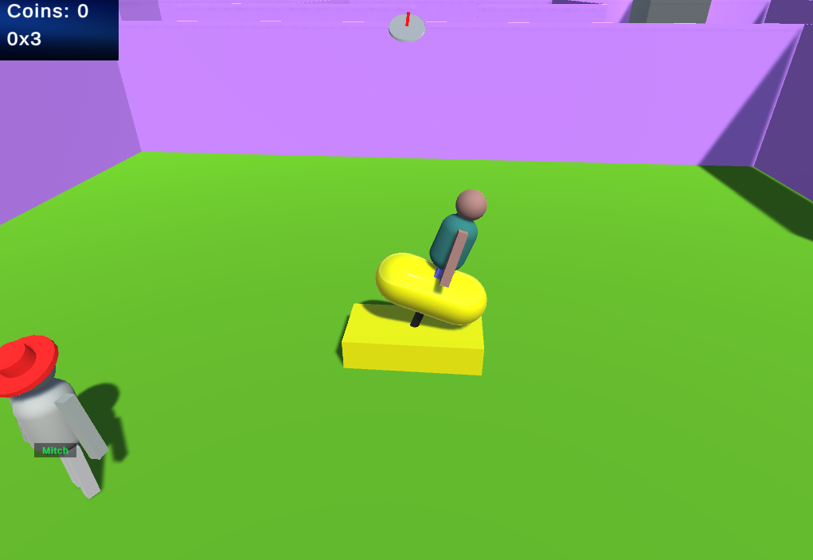


# MMO Tech Demo

The purpose of this technical demo is to show one method of how to make a basic MMO. Including a chat system, player persistence, multiple flowing ColyseusRooms and networked interactable objects. The demo is designed to work with Colyseus version 0.14.7 and [Unity version 2020.1.5f1](https://unity3d.com/unity/qa/lts-releases).

  

**[Download demo](https://github.com/colyseus/unity-demo-mmo/archive/main.zip)** ([View source code](https://github.com/colyseus/unity-demo-mmo/))

  

[Play the demo!](https://sac-dt.colyseus.dev/)

  


  

## Getting Started

  

### Launching a local server

  

You need to install and launch the server from the **provided Server directory** for this demo to function properly. Simply follow the instructions found underneath [“Running the demo server” in the Unity3d section of these docs](/getting-started/unity3d-client/#running-the-demo-server).

  

### ColyseusSettings ScriptableObject

  

All server settings can be changed via the ColyseusSetting ScriptableObject located here:

  


  

If you are running a local server, the default settings should be sufficient, however if you wish to host a server you’ll need to change the **Colyseus Server Address** and **Colyseus Server Port** values accordingly.

  

### Playing the Demo

  

Start the player in the scene “MMOLoginScene” located at `ColyseusTechDemo-MMO\Assets\Scenes\MMOLoginScene`. If this is your first time, you'll need to create  an account. Input your e-mail, password and then login to begin. If you are successful, the client will load the “TowerScene” scene and place a NetworkedEntity in it. At any point you can press the escape key to view the controls, customize your avatar or exit to the main menu. You will be transferred into a different room by walking into the grey cubes that are located on sides of rooms.
  

## Demo Overview
This demo was designed to show how a user could potentially design and implement an MMO style game using Colyseus. It highlights the following features:
### Dynamic Rooms
MMORooms are created and disposed of as needed. When a player enters a grid space, we join a room where it's `progress` value is set to the grid values, as seen in `arena.config.ts`:
```javascript 
gameServer.define('lobby_room', MMORoom).filterBy(["progress"]); // Filter room by "progress" (which grid we're wanting to join EX: -1x2)
```
As players move throughout the world, they join/leave rooms based off of their position in the world grid. A message is sent from the client to the server stating that the player is trying to update their progress, which we then catch in `MMORoom.ts`:
```javascript
this.onMessage("transitionArea", (client: Client, transitionData: Vector[]) => {
if (transitionData == null || transitionData.length < 2) {
	logger.error(`*** Grid Change Error! Missing data for grid change! ***`);
	return;
}
this.onGridUpdate(client, transitionData[0] as  Vector2, transitionData[1] as  Vector3);
});
```
After determining what the new grid position is, the client is given a new SeatReservation to consume, thus joining the correct ColyseusRoom for their new grid position. A similar flow also occurs when Logging in/Signing up (see <b>Player Persistence</b> section).
### Chat System

An additional ColyseusRoom is used to handle the Chat system: `ChatRoom.ts`. In both the client and the server, anywhere we join or leave an MMORoom we also join or leave a ChatRoom. These ChatRooms are filtered by `roomId` which is the ID of the MMORoom it is connected to.
When a client sends a message, it's added to the ChatRoomState's ChatQueue, triggering a state change on all connected clients. Every new message that comes in receives a `timeStamp` value, after which it will be removed from the queue.
### Player Persistence
!!! tip "User Authentication Note"
		This demo makes use of a very basic user authentication system with the intent of having 
		player persistence for unique user accounts and should NOT be used as a real
		world example of how to implement user authentication as a whole.
		Do NOT use any email and password combination you actually use anywhere else.
		
In this demo, unique player accounts are persisted in a database in order to keep track of a player's progress (which room they are currently in and which room they were in last), position, coin balance, and more.    
A player account is necessary to play this demo. With successful user authentication, a seat reservation for a room is sent back to the client.  The session Id of that seat reservation is saved to the player's account entry in the database as a "pendingSessionId". When the client attempts to consume the seat reservation, in order to join the room, a player account look up operation using the "pendingSessionId" is performed in the "onAuth" handler of the room. If no player account with a matching "pendingSessionId" exists, the client will not be allowed to join the room. However, with a successful player account look up, the "pendingSessionId" will become an "activeSessionId" and the client will join the room.  
A player's progress is used to filter rooms during the matchmaking process. For example, a player with a progress value of "1,1" (representing grid area coordinates 1x1) will matchmake into a room with the same progress value if it already exists. If no room with that progress value exists, then one shall be created. This way, rooms for each grid coordinate only exist as players are in them. A player's progress is updated as they leave one grid area to move to another via one of the exit doors.
### Interactable Elements

Grid spaces may have `Interactables` scattered around them. These are client-side representations of `InteractableState` schema objects that are placed within the editor when we make a new grid space prefab. When a player performs an interaction with one of these objects, the client will send a `objectInteracted` message to the server. If the server is not yet aware of the Interactable ID that has been provided, it will create a new schema reference which will be added to the room's schema map and makes its way back to the client. The server will then check if the Client meets the requirements to perform an interaction. If successful, all clients will receive an `objectUsed` message broadcast, along with the interactable's ID and the user who interacted with it. On the client's side, the appropriate `NetworkedEntity` and `Interactable` objects will be told to perform together.
This demo comes with 4 different types of interactables that you can find in the various grid spaces:
- Button Podium
    - Gives the interacting user 1 coin per press
- Coin Op
    - A small ride that will disable your controls temporarily and bounce your NetworkedEntity around. Costs 1 coin per use
- Teleporter
    - A small platform that will teleport a user to it's "exit platform". Costs 2 coins to use
- FX Swirl
    - An alternate to the Button Podium that costs nothing and gives nothing, but displays a cool effect when pressed (uses the DEFAULT server type)

## Adjusting the Demo

As you play around with this demo, you may want to make some adjustments to better familiarize yourself with what is happening. Below, you’ll learn how to make these minor adjustments.

### Chat Message Life Time
On the client side, you can change the length of time a message shows for by changing the public `messageShowTime` variable on `ChatManager.cs` which will then be sent to the server when Joining/Creating a room in `MMOManager.cs`:
```csharp
private async void JoinChatRoom()
{
    ColyseusRoom<ChatRoomState> chatRoom = await client.JoinOrCreate<ChatRoomState>("chat_room", new Dictionary<string, object>() { { "roomID", Room.Id }, {"messageLifetime", ChatManager.Instance.messageShowTime} });
    ChatManager.Instance.SetRoom(chatRoom);
}
```
### Adding Your Own Interactables
If you want to add a new interactable to the client, it must inherit from `Interactable.cs`. Check out any of the other Interactables for ideas of what you can do. If you want to override the `serverType` value on you Interactable, you should ALSO add a case for your new `serverType` on the server in `interactableObjectFactory.ts`:
```javascript
export  function  getStateForType(type: string) : InteractableState {
	let  state : InteractableState = new  InteractableState();
	//Any new types need an appropriate constructor in here or they will return empty
	switch(type){
		case("DEFAULT"):
		{
			state.assign({
				coinChange :  0,
				interactableType :  type,
				useDuration :  5100.0
			});
			break;
		}

		case("BUTTON_PODIUM"):
		{
			state.assign({
				coinChange :  1,
				interactableType :  type,
				useDuration :  10000.0
			});
			break;
		}
		case("COIN_OP"):
		{
			state.assign({
				coinChange : -1,
				interactableType :  type,
				useDuration :  5100.0
			});
			break;
		}
		case("TELEPORTER"):
		{
			state.assign({
				coinChange : -2,
				interactableType :  type,
				useDuration :  5100.0
			});
			break;
		}
	}
	return  state;
}
```
The variable `coinChange` is the amount a user's coin count should change upon use. If the value is negative (the interactable COSTS coins to use) the server will confirm that the user has enough coins to use it before responding with success, as seen in the function `handleObjectCost` in `MMORoom.ts`:
``` javascript
handleObjectCost(object: InteractableState, user: NetworkedEntityState): boolean {
    let cost: number = object.coinChange;
    let worked: boolean = false;

    //Its a gain, no need to check
    if (cost >= 0) {
      user.coins += cost;
      worked = true;
    }
    //Check if user can afford this
    if (cost < 0) {
      if (Math.abs(cost) <= user.coins) {
        user.coins += cost;
        worked = true;
      }
      else {
        worked = false;
      }
    }

    return worked;
  }
```
If this check is successful, object interaction will move forward normally.
The variable `useDuration` is used to factor in how long an interactable will remain `inUse` after a user interacts with it. When an interactable gets used, it's `availableTimestamp` is set as so:
``` javascript
interactableObject.inUse = true;
interactableObject.availableTimestamp = this.state.serverTime + interactableObject.useDuration;
```
The server then checks during each `simulationInterval`:
``` javascript
checkObjectReset() {
    this.state.interactableItems.forEach((state: InteractableState) => {
      if (state.inUse && state.availableTimestamp <= this.state.serverTime) {
        state.inUse = false;
        state.availableTimestamp = 0.0;
      }
    });
  }
```
This resets the `inUse` value for any interactables in the MMORoom if the `serverTime` says it's time to do that.
