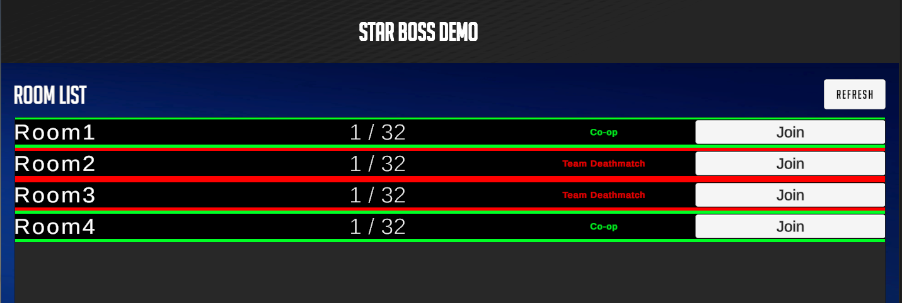

# Starboss 技术演示
该示例以 [Unity Procedural Boss Demo](https://www.youtube.com/watch?v=LVSmp0zW8pY) [(源代码参见这里)](https://on.unity.com/37K5j1b) 作为基础, 由我们的团队将其转化了为带有两种不同游戏模式的多人在线游戏.

本技术演示的目的在于展示如何将一个现有的单人游戏项目转化为一个完整的, 多人在线的游戏生命周期. 该演示设计使用 Colyseus 0.14.7 版本以及 [Unity version 2020.1.5f1](https://unity3d.com/unity/qa/lts-releases).

**[下载演示源码](https://github.com/colyseus/unity-demo-starboss/archive/main.zip)** ([在线查看源代码](https://github.com/colyseus/unity-demo-starboss/))

[玩玩看!](https://sac-dt.colyseus.dev/)


## 开始

### 启动本地服务器

您需要以 **提供的 Server 目录** 安装并启用服务器来打开本演示. 按照 [这些文档中 Unity3d 部分的 "运行演示服务器"](/getting-started/unity3d-client/#running-the-demo-server) 中的说明操作即可.

### ColyseusSettings ScriptableObject

服务器的所有设置都可通过此处的 ColyseusSetting ScriptableObject 进行修改:


如果您运行的是本地服务器, 默认的设置就能够满足需求; 但若您希望托管服务器, 则需要按需更改 **Colyseus 服务器地址** 和 **Colyseus 服务器端口**.

### 进入游戏

打开位于 `Assets\StarBoss\Scenes\StarBossLobby` 的场景 "StarBossLobby" 进入游戏. 输入您的用户名然后创建房间开始游戏. **如果您无法进入创建房间界面, 请确认本地服务器运行正常, 并核查 Unity 编辑器的错误日志.** 如果一切顺利, 客户端将加载 "Scene_Dev_Environment" 场景. 如果您按下 Enter 键或者点击 “Start” 按钮, 您将进入 "准备就绪" 状态, 然后游戏将会开始. 如果您想等待更多玩家加入, 必须等所有玩家都 "准备就绪" 后游戏才会开始. 如果您创建了 Team Deathmatch 房间, 则至少需要再有 1 名玩家加入另一边的队伍, 之后游戏才能开始.

## 演示概览

### 创建并列出不同游戏模式的房间
在客户端 `StarBossLobbyController.cs` 里被覆盖的 `CreateRoom` 函数中, 您会看到我们是在哪里做出的, 该启动合作模式房间还是对战模式房间的决定:
```csharp
string gameModeLogic = coopToggle.isOn ? "starBossCoop" : "starBossTDM";
roomOptions = new Dictionary<string, object> {{"logic", gameModeLogic }, { "scoreToWin", 3 } };
LoadMainScene(() => { ExampleManager.Instance.CreateNewRoom(selectRoomMenu.RoomCreationName, roomOptions);
```
在服务器端的 `StarBossRoom.ts` 里我们收到这些 `roomOptions` 并使用  `logic` 成员来决定该创建哪种类型的房间:
```javascript
// 取得房间的自定义逻辑
const  customLogic = await  this.getCustomLogic(options["logic"]);
if(customLogic == null) logger.debug("NO Custom Logic Set");
try{
	if(customLogic != null) {
		this.setMetadata({isCoop:  options["logic"] == "starBossCoop" });
		customLogic.InitializeLogic(this, options);
	}
}
catch(error){
	logger.error("Error with custom room logic: " + error);
}
```
这一行:
```javascript
this.setMetadata({isCoop:  options["logic"] == "starBossCoop" });
```
我们在房间元数据中为 `isCoop` 赋值, 这样我们就可以在客户端使用该值以显示相应的房间类型.

为做到这一点, 我们在客户端创建了一个包含 `isCoop` 值的可序列化类 `StarBossRoomMetaData.cs`. 之后会在我们自定义的 `StarBossRoomAvailable` 中使用此类, 它继承自 `ColyseusRoomAvailable`:
```csharp
[System.Serializable]
public class StarBossRoomAvailable : ColyseusRoomAvailable {
    public StarBossRoomMetaData metadata;
}
```
之后在 `ExampleManager.cs` 里我们已经更新了 `GetAvailableRooms` 函数用来接收 `StarBossRoomAvailable` 类型的数据:
```csharp
public async void GetAvailableRooms() {
    StarBossRoomAvailable[] rooms = await client.GetAvailableRooms<StarBossRoomAvailable>(_roomController.roomName);
    onRoomsReceived?.Invoke(rooms);
}
```
我们还更新了 `OnRoomsReceived` 委托调用来使用 `StarBossRoomAvailable`. 最后, 对于收到的每个条目, 我们实例化一个附加有 `RoomListItem` 组件的对象, 然后将可用房间的引用传给它. 在 `RoomListItem.cs` 的函数 `DetermineMode` 中:
```csharp
bool isCoop = roomRef.metadata.isCoop;

if (isCoop) {
    roomName.text = roomRef.roomId;
    gameMode.text = "Co-op";
    gameMode.color = coopColor;
    backgroundImage.color = coopColor;
}
else {
    roomName.text = roomRef.roomId;
    gameMode.text = "Team Deathmatch";
    gameMode.color = deathmatchColor;
    backgroundImage.color = deathmatchColor;
}
```
最终结果如图所示:


## 调整演示

当您把玩该演示的时候, 您可能希望进行一些调整, 帮您更好地了解各种机制. 下面您会学习到微调带来的效果.

### Team Deathmatch 模式胜利得分

在客户端 `StarBossLobbyController.cs` 里被覆盖的 `CreateRoom` 中设置了对战模式取得胜利得分最大值为 3:
```csharp
roomOptions = new Dictionary<string, object> {{"logic", gameModeLogic }, { "scoreToWin", 3 } };
LoadMainScene(() => { ExampleManager.Instance.CreateNewRoom(selectRoomMenu.RoomCreationName, roomOptions);
```

在服务器端, 我们收到这些 `roomOptions` 并用以初始化游戏逻辑. 只有在初始化对战房间时, 我们才用得着 `scoreToWin` 配置项, 用法如 `starBossTDM.js` 里那样:
```javascript
roomRef.tdmScoreToWin = options["scoreToWin"] ? Number(options["scoreToWin"]) : 10;
```
