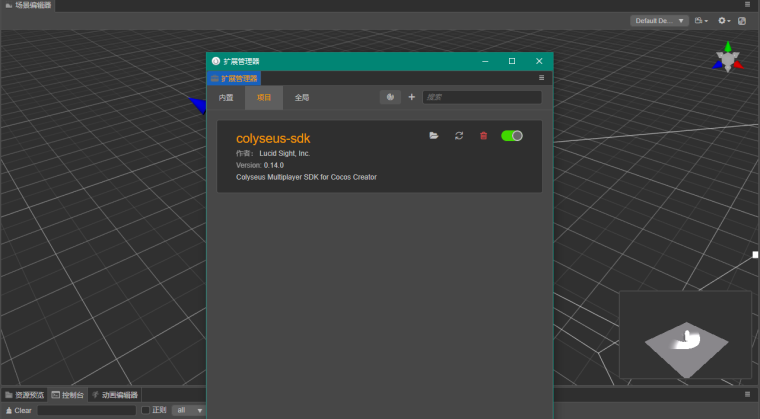
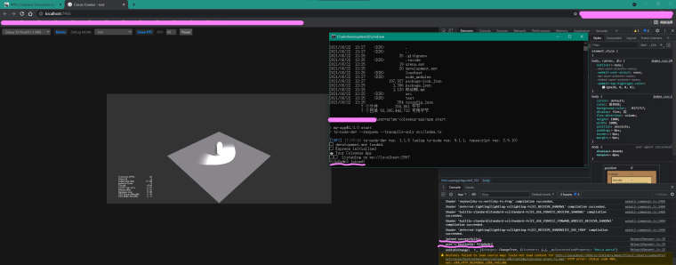

# Cocos Creator 3

[Cocos Creator](https://cocos.com/creator) 是跨平台 2D/3D 游戏开发工具.

Colyseus SDK 在 Cocos Creator 的运用上与 [JavaScript SDK](https://docs.colyseus.io/getting-started/javascript-client/) 类似. 主要区别在于如何通过 Cocos Creator 的 [TypeScript 组件来引入服务](https://docs.colyseus.io/colyseus/getting-started/cocos-creator/#importing-from-the-extension).

!!! tip "想要具体实例?"
    看看 [Tic Tac Toe 项目](https://github.com/colyseus/cocos-demo-tictactoe).

#### 1. 安装扩展插件

- 打开 [Cocos Store](https://store.cocos.com/app/en/detail/2937/) (菜单: "扩展" &raquo; "商店")
- 搜索 "Colyseus SDK"
- 下载扩展插件
- 将下载的 zip 包解压到 "<项目目录>/extensions/" 文件夹下
  
- 启动 Cocos Creator, 打开扩展管理器 (菜单: "扩展" » "扩展管理器")
- 在 "项目" 页上点击 "扫描插件" 按钮
- 激活找到的 "colyseus-sdk" 插件
  


## 2. 更新 `tsconfig.json` 文件

确认 `"compilerOptions"` 类目下有 `"esModuleInterop": true`:

```json
  // ...

  /* 此处进行自定义配置. */
  "compilerOptions": {
    // ...
    "esModuleInterop": true
    // ...
  }
  // ...
```

重新启动 Cocos Creator.

## 3. 导入扩展插件

根据路径导入 Colyseus 扩展插件:

```typescript
import Colyseus from 'db://colyseus-sdk/colyseus.js';
```

下面给出一个更详细的示例方便大家应用于自己的项目之中.

把如下内容命名为 `NetworkManager.ts` 存入项目的 `assets` 文件夹里.

```typescript
import { _decorator, Component, Node } from 'cc';
const { ccclass, property } = _decorator;

import Colyseus from 'db://colyseus-sdk/colyseus.js';

@ccclass('NetworkManager')
export class NetworkManager extends Component {
    @property hostname = "localhost";
    @property port = 2567;
    @property useSSL = false;

    client!: Colyseus.Client;
    room!: Colyseus.Room;

    start () {
        // Instantiate Colyseus Client
        // connects into (ws|wss)://hostname[:port]
        this.client = new Colyseus.Client(`${this.useSSL ? "wss" : "ws"}://${this.hostname}${([443, 80].includes(this.port) || this.useSSL) ? "" : `:${this.port}`}`);

        // Connect into the room
        this.connect();
    }

    async connect() {
        try {
            this.room = await this.client.joinOrCreate("my_room");

            console.log("joined successfully!");
            console.log("user's sessionId:", this.room.sessionId);

            this.room.onStateChange((state) => {
                console.log("onStateChange: ", state);
            });

            this.room.onLeave((code) => {
                console.log("onLeave:", code);
            });

        } catch (e) {
            console.error(e);
        }
    }
}
```

然后就可以把 `NetworkManager` 作为组件安放在 Cocos Creator 的任意节点上.

因为上面用到了 `@property` 装饰词, 所以 `hostname`, `port` 和 `useSSL` 这些变量都可以在 Cocos Creator 编辑器中修改:





----

#### 另一种方法: 手动将 colyseus.js 文件导入项目 (不使用扩展插件)

- [从 GitHub 上下载最新版 `colyseus-js-client.zip`](https://github.com/colyseus/colyseus.js/releases).
- 把 `colyseus-js-client.zip` 里的文件解压到 `assets/` 文件夹里.
- 把 `colyseus.js` 和 `colyseus.d.ts` 文件移动到 Cocos Creator 项目的 `scripts` 文件夹里.
- 在资源面板点击 `colyseus.js`, 开启 "Import As Plugin" (详见下文图片)
- **TypeScript**: 使用 `import Colyseus from "./colyseus.js";` 引入
- **JavaScript**: 使用 `const Colyseus = require("./colyseus.js");` 引入


