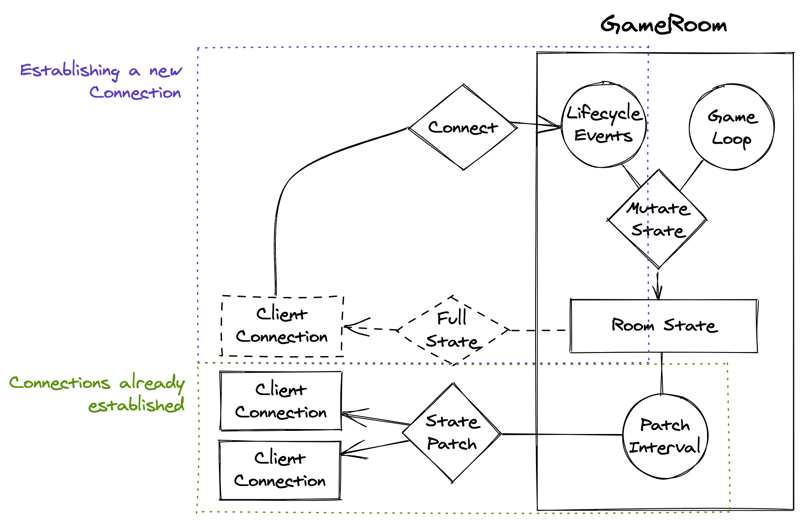

<!-- ---
icon: material/sync
--- -->

# State Synchronization

- [**Schema definitions**](/state/schema) – define your state structure using Colyseus' `Schema` class.
- [**Client-side callbacks**](/state/schema-callbacks) – listen to state changes on the client-side.

## How state synchronization works?

- When the client joins a room, it receives the full encoded state from the server.
- State mutations on the server-side are enqueued at a per-property level. (Only the last mutation of each property is kept)
- Enqueued mutations are binary-encoded and sent to **all clients** at every [patchRate](/server/room/#patchrate-number) interval, and then cleared.
- Client-side [schema callbacks](/state/schema-callbacks) are triggered after patches were applied.

## Working with schemas structures

- Only the server-side is responsible for mutating schema structures
- The client-side must have the same `Schema` definitions generated through [`schema-codegen`](#client-side-schema-generation). _(Optional if you're using the [JavaScript SDK](/getting-started/javascript-client/))_
- In order to get updates from the server, you need to [attach callbacks on schema instances in the client-side](#callbacks).
- The client-side should never perform mutations on schema - as they are going to be replaced as soon as the next change come from the server.

